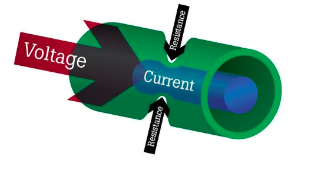
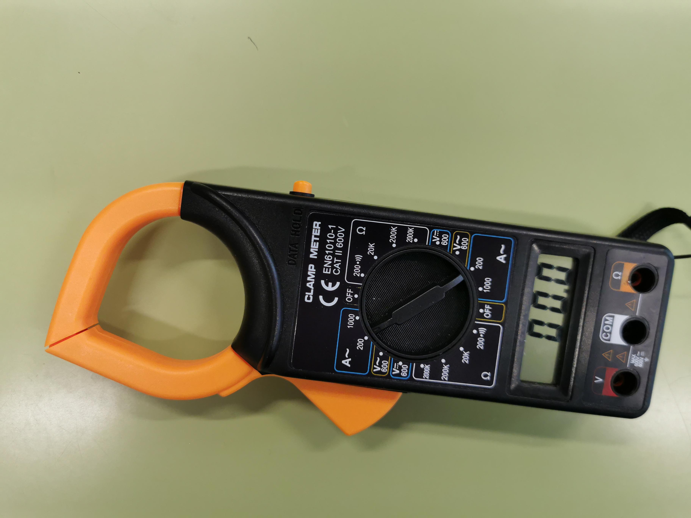
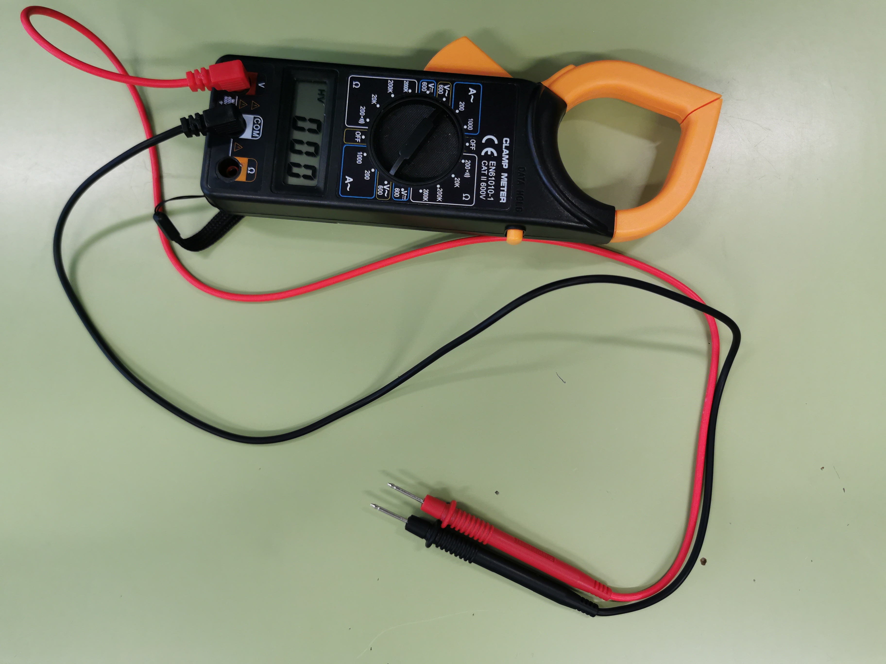
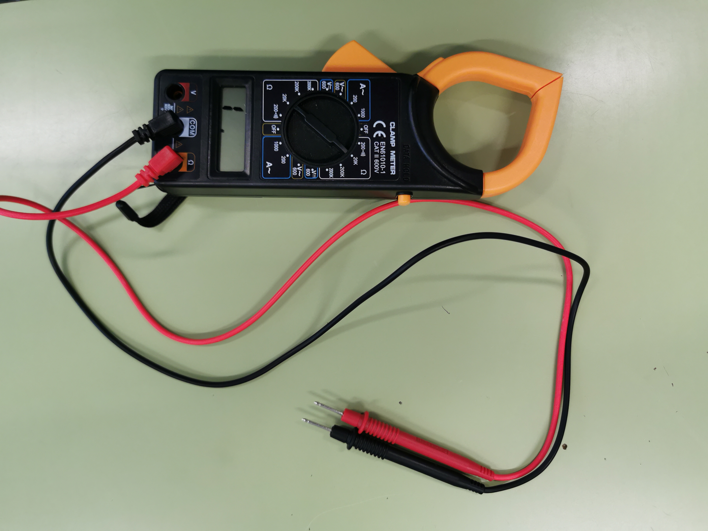
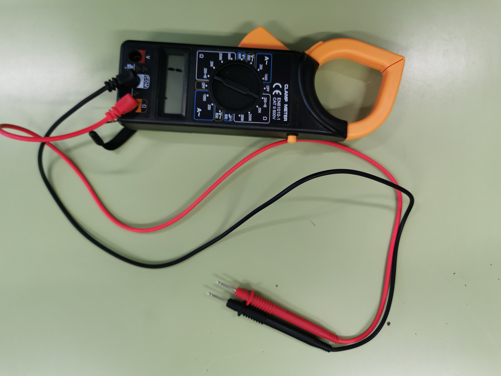
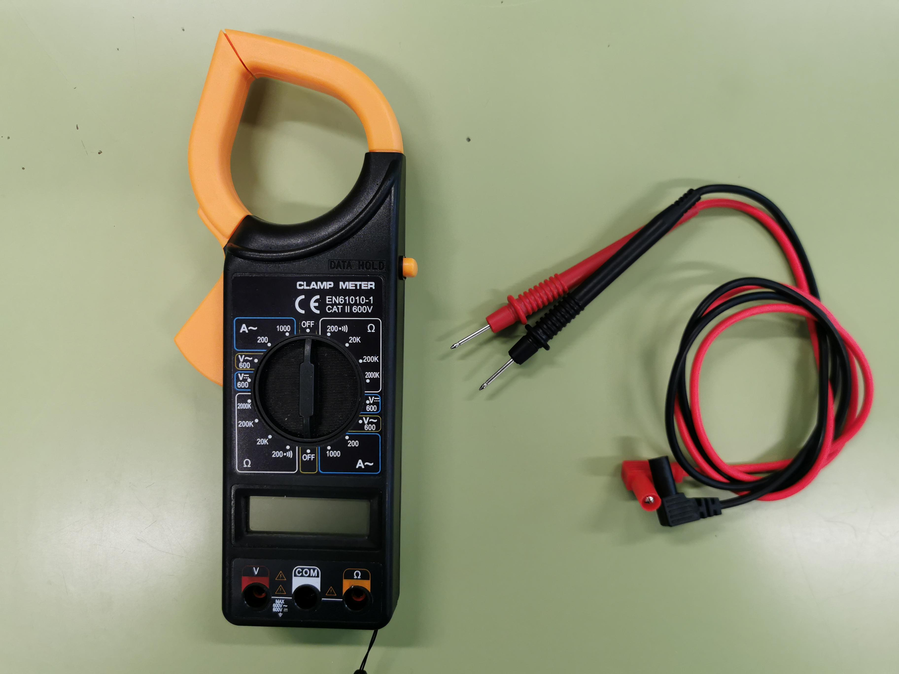

Características eléctricas y medidas de magnitudes.
===================================================

Índice
======

- Magnitudes eléctricas:
    * Tensión.
    * Intensidad.
    * Resistencia.
    * Potencia.

- Medición de las magnitudes eléctricas:
    * Manejo del polímetro.
    * Manejo de la pinza amperimétrica.
    * Medidas de aislamiento y continuidad.

Magnitudes eléctricas
=====================

Tensión
-------

Según la wikipedia la tensión eléctrica o diferencia de potencial 
(también denominada voltaje)​ es una magnitud física que cuantifica la 
diferencia de potencial eléctrico entre dos puntos. También se puede 
definir como el trabajo por unidad de carga ejercido por el campo 
eléctrico sobre una partícula cargada para moverla entre dos posiciones 
determinadas. Se puede medir con un voltímetro.​ Su unidad en el Sistema 
Internacional de Unidades (SI) es el voltio.

En una analogía hidráulica la tensión sería la presión en una 
tubería. Como indica la definición de la wikipedia su unidad es el 
voltio. Palabras con significado similar son: voltaje, tensión, 
diferencia de potencial y fuerza electromotriz.

Intensidad
----------

Según la wikipedia se denomina intensidad de corriente eléctrica al 
caudal de corriente (cantidad de carga por unidad de tiempo) se le 
denomina intensidad de corriente eléctrica (representada comúnmente con 
la letra I). En el Sistema Internacional de Unidades se expresa en 
culombios por segundo (C/s), unidad que se denomina amperio (A).

En una analogía hidráulica seria el caudal de agua, la cantidad de 
agua que pasa por una sección de tubería.

Resistencia eléctrica
---------------------

Se le denomina resistencia eléctrica a la oposición al flujo de 
corriente eléctrica a través de un conductor.1​2​ La unidad de resistencia
en el Sistema Internacional es el ohmio, que se representa con la letra 
griega (Ω)

Cuanto más estrecho y largo es un cable, mayor resistencia presenta.
De igual modo, cuanto peor conductor es un cable, mayor resistencia 
opone (p.e. el aluminio tiene mayor resistencia que el cobre).

La siguiente imagen muestra una analogía hidráulica de las tres 
magnitudes:

Ley de Ohm
----------

La ley de Ohm es la fórmula que relaciona todas estas magnitudes. Su
expressión es la siguiente:

<blockquote>

</blockquote>

Donde:
* V es el voltaje en voltios
* R es la resistencia eléctrica en ohmios
* I es la intensidad en Amperios

Otra forma de ver esta fórmula es con el triangulo de la ley de Ohm,
donde tapamos con la mano la magnitud que desconocemos, y las magnitudes
que quedan son la fórmula a aplicar.

Potencia
--------

Según la wikipedia, la potencia eléctrica es la proporción por unidad 
de tiempo, o ritmo, con la cual la energía eléctrica es transferida por 
un circuito eléctrico, es decir, la cantidad de energía eléctrica 
entregada o absorbida por un elemento en un momento determinado. 
La unidad en el Sistema Internacional de Unidades es el vatio o watt 
(W).

La fórmula que se utiliza para relacionar la potencia con la intensidad
y el voltaje es:

<blockquote>

</blockquote>

Donde:
* P es la potencia en vatios
* V es el voltaje en voltios
* I es la intensidad en amperios

Formulario y cheatsheet
-----------------------

<table>
	<tr>
		<td></td>
		<td></td>
		<td></td>
	</tr>
	<tr>
		<td></td>
		<td></td>
		<td></td>
	</tr>
</table>

&nbsp;

|Magnitud   |Letra Magnitud|Unidad  |Letra Magnitud|
|:---------:|:------------:|:------:|:------------:|
|Potencia   |P             |vatios  |W             |
|Voltaje    |V             |voltios |V             |
|Intensidad |I             |amperios|A             |
|Resistencia|R             |ohmios  |Ω             |

Medición de las magnitudes eléctricas
=====================================

Manejo del polímetro
--------------------

Todos los polímetros tienen funcionamientos similares. Existe un 
selectro, que normalmente es rotatorio que permite elegir magnitud y
fondo de escala.

Algunos también tienen varios bornes de conexión según la magnitud a
medir, y finalmente algunos también disponen de pinza amperimétrica para
medir la intensidad sin necesidad de desconectar ningún elemento de la
instalación.

En clase utilizaremos un polímetro con pinza amperimétrica Electraline
modelo 59505.

**Posiciones habituales del polímetro**

* **Intensidad:** colocando la rueda en el simbolo **A~ (200)** y sin 
necesidad del uso de bornes.(ver imagen 1).
* **Tensión** colocando la rueda en el símbolo **V~**, el cable negro
conectado al borne **COM** y el cable rojo conectándolo al borne **V
(600)**
(ver imagen 2).
* **Resistencia** colocando la rueda en el símbolo **Ω (20k)**, el cable
negro conectado al borne **COM** y el cable rojo en el borne **Ω** (ver
imagen 3).
* **Continuidad** colocando la rueda en el símbolo **Ω (200)**, el cable
negro conectado al borne **COM** y el cable rojo en el borne **Ω** (ver
imagen 4).
* **Apagado** colocando la rueda en el símbolo **OFF** ver (imagen 5)

