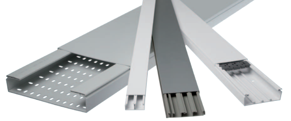

Características eléctricas y medidas de magnitudes.
===================================================

Índice
======

+ Canalizaciones y tubos:
    - Tipos y características.
+ Sistemas de instalación:
    - Bajo tubos protectores.
    - Sobre paredes.
    - Enterrados.
    - Aéreos.
    - En canaletas de protección.
    - Bajo molduras.
+ Conductores eléctricos:
    - Aislados.
    - Desnudos.
    - Rígidos.
    - Flexibles.
+ Receptores.
+ Elementos de alumbrado interior/exterior.
+ Elementos calefactores.
+ Motores.
+ Elementos de señalización.
+ Elementos de maniobra:
    - Seccionadores.
    - Pulsadores.
    - Interruptores.
    - Conmutadores.
    - Telerruptores.
+ Elementos de conexión:
    - Base de enchufe
    - clavijas
    - punteras
    - regleta de conexión
    - dedal de conexión
    - caja de conexión o derivación.
+ Elementos de señalización:
    - números de señalización e identificación
    - bandas de identificación y señalización.
+ Elementos de protección y seguridad
    - Interruptor diferencial
    - Interruptor magnetotérmico
    - protector sobretensiones
    - línea de tierra.
+ Herramental básico y específico.
+ Partes de las instalaciones:
    - Acometida.
    - Caja de protección.
    - Línea de alimentación.
    - Caja de derivación.
    - Contadores.
    - Derivación individual.
    - Cuadro de mando y protección.
    - Circuitos interiores.

Canalizaciones y tubos
======================

Las canalizaciones y tubos son los espacios por donde circularan los
cables conductores. Hay varios tipos y su uso estará permitido en
algunas instalaciones y en otras no.

Tipos y características
-----------------------

### Tubos en canalizaciones fijas en superficie

Los tubos en las canalizaciones superficiales deberán ser rígidos
por lo general, y las características mínimas son:

+ Resistencia a la compresión Fuerte (1250N) - Código 4
+ Resistencia al impacto Media (2J) - Código 3
+ Temperatura mínima (-5°C) - Código 2
+ Temperatura máxima (+60°C) - Código 1
+ Contra penetración de objetos sólidos D ≥ 1mm
+ Contra penetración de gotas de agua cayendo verticalmente con el tubo a 15°  
+ No propagador de la llama

El ejemplo más común de este tipo de tubos es el llamado **tubo H**

### Tubos en canalizaciones empotradas
En las canalizaciones empotradas los tubos podrán ser rígidos, curvables o flexibles y estarán empotradas en obras de fábrica (paredes, techos y falsos techos), huecos de la construcción, canales protectoras de obra. También pueden estar embebidos en hormigón aunque sus características serán diferentes.
Para las instalaciones empotradas habituales las características mínimas son:

+ Resistencia a la compresión Ligera (320N) - Código 2
+ Resistencia al impacto Ligera (1J) - Código 2
+ Temperatura mínima (-5°C) - Código 2
+ Temperatura máxima (+60°C) - Código 1
+ Contra penetración de objetos sólidos D ≥ 1mm
+ Contra penetración de gotas de agua cayendo verticalmente con el tubo a 15°  
+ No propagador de la llama

El ejemplo más común de este tipo de tubos es el llamado **tubo forroplast**

### Canales protectoras

La canal protectora es un material de instalación constituido por un perfil de paredes perforadas o no perforadas, destinado a alojar conductores o cables y cerrado por una tapa desmontable, según se indica en la ITC-BT-01 "Terminología".

Las canales serán conformes a lo dispuesto en las normas de la serie UNE-EN 50.085 y se clasificarán según lo establecido en la misma.

Las características de protección deben mantenerse en todo el sistema. Para garantizar éstas, la instalación debe realizarse siguiendo las instrucciones del fabricante.

### Bandejas y bandejas de escalera

Con posterioridad a la publicación del REBT se publicó la norma UNE-EN 61537 “Sistemas de bandejas y bandejas de escalera para conducción de cables” el cuál, como sistema de instalación, ya se encuentra definido en la ITC-BT-20 apto. 2.2.9 y por lo tanto se hace necesario desarrollar sus características de instalación y montaje.

El cometido de las bandejas es el soporte y la conducción de los cables. Sólo podrá utilizarse conductor aislado bajo cubierta. Debido a que las bandejas no efectúan una función de protección, se recomienda la instalación de cables de tensión asignada 0,6/1 kV.
Cabe la posibilidad de que las bandejas soporten cajas de empalme y/o derivación.

Sistemas de instalación
=======================

Se recogen los distintos sistemas de instalación de las canalizaciones tal y como los presenta también la norma UNE 2040-5-52, detallándose la forma de efectuar su instalación, así como las principales características de los conductores y de los tubos o canales protectores para cada uno de los sistemas más habituales.

Bajo tubos protectores
----------------------

Estas instalaciones se establecerán con cables de tensiones asignadas no inferiores a 0,6/1 kV, provistos de aislamiento y cubierta (por ejemplo cables de la serie UNE 21123).

Para la ejecución de las canalizaciones se tendrán en cuenta las siguientes prescripciones:

- Se fijarán sobre las paredes por medio de bridas, abrazaderas, o collares de forma que no perjudiquen las cubiertas de los mismos.
- La distancia entre dos puntos de fijación sucesivos, no excederá de 0,40 metros.
- **Cuando los cables deban disponer de protección mecánica por el lugar y condiciones de instalación en que se efectúe la misma, se utilizarán cables armados. En caso de no utilizar estos cables, se establecerá una protección mecánica complementaria sobre los mismos.**
- Se evitará curvar los cables con un radio demasiado pequeño (como mínimo 10 veces el diámetro exterior del cable).
- Los cruces de los cables con canalizaciones no eléctricas serán con una distancia mínima de 3 cm entre la superficie exterior de la canalización no eléctrica y la cubierta de los cables cuando el cruce se efectúe por la parte anterior de aquélla.
- Los puntos de fijación de los cables estarán suficientemente próximos para evitar que esta distancia pueda quedar disminuida. 
- Los extremos de los cables serán estancos cuando las características de los locales o emplazamientos así lo exijan, utilizándose a este fin cajas u otros dispositivos adecuados. La estanqueidad podrá quedar asegurada con la ayuda de prensaestopas.
- Los cables con aislamiento mineral, cuando lleven cubiertas metálicas, no deberán utilizarse en locales que puedan presentar riesgo de corrosión para las cubiertas metálicas de estos cables, salvo que esta cubierta este protegida adecuadamente contra la corrosión.
- Los empalmes y conexiones se harán por medio de cajas o dispositivos equivalentes provistos de tapas desmontables que aseguren a la vez la continuidad de la protección mecánica establecida, el aislamiento y la inaccesibilidad de las conexiones y permitiendo su verificación en caso necesario.

    - Bajo tubos protectores.
    - Sobre paredes.
    - Enterrados.
    - Aéreos.
    - En canaletas de protección.
    - Bajo molduras.

