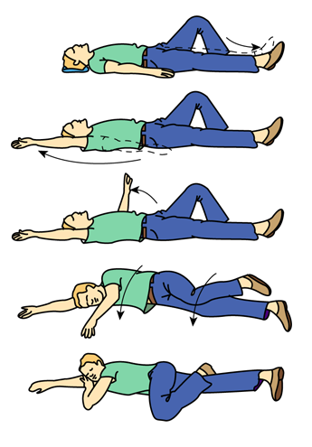
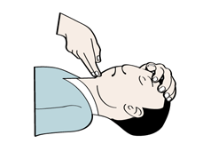
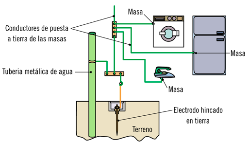
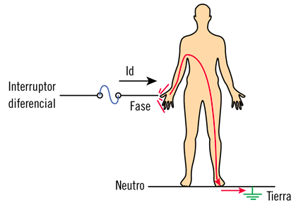
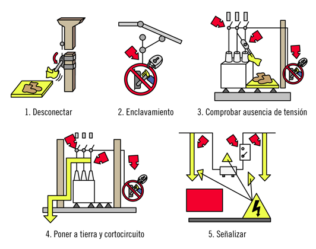

<h1>Prevención de riesgos laborales y medioambientales en las 
operaciones auxiliares de montaje de instalaciones electrotécnicas y de
telecomunicaciones en edificios.</h1>

1.- Conceptos básicos sobre seguridad y salud en el trabajo.
============================================================

Índice
------

- El trabajo y la salud.
- Los riesgos profesionales.
- Factores de riesgo.
- Consecuencias y daños derivados del trabajo:
    - Accidente de trabajo.
    - Enfermedad profesional.
    - Otras patologías derivadas del trabajo.
    - Repercusiones económicas y de funcionamiento.

El trabajo y la salud
---------------------

A través del trabajo por una parte se producen bienes y servicios y 
por otra cubrimos parte de nuestras necesidades personales, desde las
más básicas hasta las más elevadas (pirámide de Maslow).

No obstante para realizar según que tareas precisamos de cierto grado de
salud y por otra parte realizar las tareas sin los conocimientos y
métodos adecuados puede repercutir en nuestra salud.

Riesgos profesionales
---------------------

Todas las actividades profesionales conllevan un riesgo. La ley 31/1995
define **riesgo laboral** como la posibilidad de que un trabajador sufra
un determinado daño derivado del trabajo.

Por ejemplo una contusión por caída es un riesgo laboral del instalador
de telecomunicaciones

Factores de riesgo
------------------

Los factores de riesgo son aquellos factores inherentes a la actividad
que no pueden ser eliminados y que pueden materializarse en un daño al 
trabajador.

Por ejemplo los trabajos en altura para un instalador de
telecomunicaciones o los elementos sometidos a tensión para un
instalador electricista.

Consecuencias y daños derivados del trabajo
-------------------------------------------

Los daños derivados de trabajo es una consecuencia totalmente indeseable
del trabajo. El lema debe ser **todos los daños derivados del trabajo 
han de poder evitarse.**

Aun siendo indeseables suceden y tienen las siguientes consecuencias:

### Accidente de trabajo

Es cuando se materializa un riesgo laboral. Es de naturaleza inesperada
pero determinada. Es decir no sabemos cuando va a suceder, pero sabremos
la causa.

Según la LGSS un **accidente de trabajo es:**

_toda lesión que el trabajador sufra con ocasión o por consecuencia del
trabajo que ejecute por cuenta ajena_

Son accidentes de trabajo los siguientes:

- Accidentes _in itinere_, es decir al ir o al volver del trabajo
- Accidentes ocurridos en las acciones sindicales
- Accidentes ocurridos en acciones por el interés de la empresa o por
  indicación del empresario aunque sean distintos a los riesgo de una
  determinada actividad laboral
- Accidentes ocurridos por imprudencias fruto de la confianza.

**No** son accidentes de trabajo los siguientes:

- Accidentes debidos a la imprudencia temeraria
- Accidentes debidos al dolo del trabajador accidentado

### Enfermedad profesional

La LGSS define la **enfermedad profesional como:**

_La contraída a consecuencia del trabajo ejecutado por cuenta ajena,
que estén incluidas en el cuadro de enfermedaddes profesionales y que 
esta proceda por la acción de elementos o substancias que en dicho 
cuadro se indiquen para cada enfermedad._

Pueden estar causadas por (agentes físicos, químicos, biológicos, por 
inhalacion de otras sustancias, por efectos en la piel de otras 
sustancias, las causadas por agentes carcinogénicos.

### Otras patologías derivadas del trabajo

A consecuencia de una mala prevención pueden desarrollarse otras 
patologías, entre las que destacan:

- Carga de trabajo
- Fatiga
- Patologías de movimientos repetitivos
- Estrés
- Insatisfacción laboral

### Repercusiones económicas y de funcionamiento

Tanto si la materialización de un riesgo laboral es un accidente o un
incidente (no hay daños personales) pueden producirse daños materiales y
además la actividad se ve alterada en mayor o menor medida.

Por lo tanto prevenir los riesgos laborales también mejora la 
prosperidad de empresa y trabajador.

2.- Riesgos generales y su prevención.
=====================================

Índice
------

- Riesgos en el manejo de herramientas y equipos.
- Riesgos en la manipulación de sistemas e instalaciones.
- Riesgos en el almacenamiento y transporte de cargas.
- Riesgos asociados al medio de trabajo:
    - Exposición a agentes físicos, químicos o biológicos.
    - El fuego.
- Riesgos derivados de la carga de trabajo:
    - La fatiga física.
    - La fatiga mental.
    - La insatisfacción laboral.
- La protección de la seguridad y salud de los trabajadores:
    - La protección colectiva.
    - La protección individual.

Riesgos en el manejo de herramientas y equipos.
-----------------------------------------------

Existen diferentes tipos de herramientas y equipos. Cada cual entraña
unos riesgos própios. A continuación se clasifican algunas:

- **Herramientas de corte:** Como alicates, tijeras y cúteres.
- **Herramientas punzantes:** Como punzones y barrenas.
- **Herramientas de golpeo:** Como martillos y mazos.
- **Herramientas de desgaste:** Como limas y lijas.

Estas herramientas presentan riesgo de cortes, punzonamientos, 
aplastamientos y quemaduras en la piel

Además existen diferentes riesgos colaterales a los ya mencionados como
pueden ser:

- Riesgos debidos a la presencia de tensión en el equipo
- Riesgos debidos al ruido (especialmente a los superiores a 80dB y de
más de una hora de duración.
- Riesgos debidos a la maquinaria móvil (atropellos y golpes)
- Riesgos debidos a la proyección de elementos

Para evitar estos riesgos se dispone de diferentes estrategias: uso de
guantes, pantallas mecanismos de seguridad en las máquinas, protección
auditiva y calzado de seguridad.

No es necesario el uso de todo el equipo. Sólo de aquellos elementos que
la actividad requiera.

Riesgos en la manipulación de sistemas e instalaciones
------------------------------------------------------

Se analizan sistemas e instalaciones que no tienen consideración de
máquinas como son:

- Equipos a presión
- Recipientes a presión simples
- Aparatos de gas
- Instalaciones de gas
- Instalaciones eléctricas
- Almacenamiento de productos químicos
- Instalaciones de calefacción, climatización y ACS
- Instalaciones frigoríficas
- Ascensores. y aparatos de elevación
- Instalaciones nucleares y radioactivas
- Instalación y utilización de aparatos de rayos X.

Para cada una de estas instalaciones existen Reglamentos e ITCs
complementarias, como el RD 842/2002 de para instalaciones eléctricas o
el RD 809/2021 para los equipos a presión. El simple cumplimiento de
estos reglamentos ya crea un considerable marco de seguridad.

No obstante al trabajar con estas instalaciones en concreto puede ser
necesario adoptar medidas adicionales (llevar explosímetro, prendas de
abrigo, etc.)

Riesgos en el almacenamiento y transporte de cargas
--------------------------------------------------
En general el transporte de cargas deberá ser mecanizado. Aun así
existen los siguientes riesgos laborales:

- **Los debidos a la maquinaria usada para el almacenamiento:** Como
por ejemplo atropello, vuelco, o golpes con elementos activos.
- **Los debidos a los elementos estructurales** Falla, o vuelco de
estanterías por ejemplo.
- **Debidos a la caída de cargas**

Las medidas preventivas son:

- Estudio del suelo
- Estudio del sistema de trabajo
- Planificación de dimensiones, pesos y localización de cargas
- Estabilidad y resistencia estructural de soportes, estanterías
- Protección de las estanterías frente a golpes.
- Planificación de los pasillos de circulación y servicio
- Señalización de pasillos, limites de carga, cruces y cualquier tipo de
riesgo
- Buena iluminación
- Buen mantenimiento

Véase la [NTP852](https://www.insst.es/documents/94886/328096/852+web.pdf/b0f07659-c7d6-43da-a4d1-f1f479765f1f)

Riesgos asociados al medio de trabajo
-------------------------------------
El también llamado **riesgo higiénico** son tratados por la rama de la 
Higiene Industrial (el conjunto de técnicas que estudia el medio 
ambiente físico, químico o biológico del trabajo para prevenir el 
desarrollo de enfermedades profesionales.

### Exposición a agentes físico químicos o biológicos:

Se exponen los diferentes riesgos así como su repercusión:

- **Agentes físicos:** Como por ejemplo las condiciones climatológicas,
la actividad física, la velocidad del aire. la iluminación el ruido y
las radiaciones. Pueden causar deshidratación, golpes de calor, 
congelación y fatiga o causar un accidente laboral.

- **Agentes químicos o biológicos:** Su entrada en el organismo son por
vias respiratorias, dermis, vía digestiva y vía parenteral, como el
amianto, el mercurio, ácidos o bases fuertes.

- **Biológicos:** Como bacterias, virus, hongos y parásitos.

### Fuego

El riesgo al fuego está presente en prácticamente cualquier actividad
para controlarlo existen diversas normativas que se han ido
implementando, por otra parte al ejecutar las diferentes tareas se debe
ir con especial cuidado de no originar, o favorecer la aparición de un
incendio.

Por ello, en cuanto a las instalaciones eléctricas no deben ayudar a 
propagar un incendio que no se haya originado en ellas. Por otra deben
evitar ellas mismas producirlo.

El primer ejemplo se soluciona, en algunos casos, utilizando materiales 
no propagadores de la llama, el segundo evitando cortocircuitos y
sobrecargas.

Riesgos derivados de la carga de trabajo
----------------------------------------

Se distinguen 2

### Fatiga física
Ocurre cuando debido a esfuerzos físicos, posturas continuadas y
en especial la manipulación manual de cargas. Estas diferentes causas
ocasionan lumbalgias, tendinitis, mialgias, hernias de disco, etc.

Por ello se deberá prestar atención a la hora de manipular cargas y
evitar sobreesfuerzos. Así como adquirir buenos hábitos posturales.

### Fatiga mental
Se originan por tener que procesar demasiada información o que esta 
información sea excesivamente compleja para el tiempo del que se
dispone.

Su consecuencias se manifiestan como cefaleas, ansiedad, insomnio, 
agresividad, depresión, etc.

Para combatir la fatiga mental puede ser necesario mejorar los hábitos
de alimentación, descanso y ejercicio. Realizar pausas en el trabajo y
redistribur la carga de trabajo.

### Insatisfacción laboral
Es la perdida de interés que experimenta un trabajador en su desempeño.

Las causas suelen estar relacionadas con un nivel alto de fatiga y baja
compensación. Las consecuencias son perdidas de concentración, de 
rendimiento, de concentración y aumento progresivo de errores.

Sus soluciones pasan por:

- Adaptar las cargas de trabajo
- Formar adecuadamente
- Mantener un buen ambiente de trabajo
- Alternar las tareas
- Establecer objetivos parciales
- Visión clara de objetivos
- Hacer pausas
- Mantener condiciones ambientales óptimas

Protección de la seguridad y salud de los trabajadores
------------------------------------------------------
Se busca desarrollar técnicas preventivas que logran reducir los 
accidentes laborales.

Existen dos grandes grupos de medidas: la colectiva y la individual. 
Prefiriéndose la primera sobre la segunda.

### Protección colectiva
Aquellas que protegen a todos los trabajadores. Como las barandillas de
una obra, el interruptor diferencial del cuadro de obras, sistemas de 
ventilación, el orden y la limpieza.

### Protección individual
Constituido principalmente por los Equipos de Protección Individual 
(EPIs). Como calzado de seguridad, arneses, casco, gafas, guantes, etc.

Deben ser individuales, ajustarse a las características anatómicas del 
usuario, aportar instrucciones de uso, y ser mantenidos y conservados
correctamente.

3.- Actuación en emergencias y evacuación
=========================================

Índice
------

- Tipos de accidentes.
- Evaluación primaria del accidentado.
- Primeros auxilios.
- Socorrismo.
- Situaciones de emergencia.
- Planes de emergencia y evacuación.
- Información de apoyo para la actuación de emergencias.

Tipos de accidentes
-------------------

Se enumeran a continuación los diferentes tipos de accidentes:

- Caídas al mismo nivel
- Caídas de personas a distinto nivel
- Caída de objetos por desplome o derrumbamiento
- Caída de objetos en su manipulación
- Caída de objetos desprendidos
- Pisadas sobre objetos
- Choques contra objetos inmóviles.
- Choques contra objetos móviles
- Golpes o cortes por objetos o herramientas
- Proyección de fragmentos o partículas
- Atrapamiento por o entre objetos
- Atrapamiento por vuelco de máquinas o vehículos
- Sobresfuerzos
- Exposición a temperaturas ambientales extremas
- Contactos térmicos
- Contactos eléctricos directos
- Contactos eléctricos indirectos
- Exposición a substancias nocivas o tóxicas
- Contactos con sustancias cáusticas o corrosivas
- Exposición a radiaciones
- Explosiones
- Incendios
- Accidentes causados por seres vivos
- Atropellos o golpes con vehículos

Alguna de las causas que pueden dar lugar a estos accidentes son:

- Zonas de operación desprotegidas (por ejemplo arquetas).
- Ausencia de alarmas (por ejemplo marcha atrás carretilla)
- Paro de emergencias inexistente o defectuoso
- Productos peligrosos no identificados
- Inestabilidad en el almacenaje
- Protección frente a contactos eléctricos
- Aberturas y huecos desprotegidos
- Escaleras inseguras o en mal estado
- Falta de orden y limpieza
- Iluminación incorrecta
- Uso indebido de herramientas o útiles de trabajo
- Fatiga física
- Fatiga mental
- Falta de corrección de riesgo
- Falta de uso de los EPI o que estos sean no adecuados

Evaluación primaria del accidentado
-----------------------------------

La falta de oxígeno en el cerebro causa lesiones irreversibles en el 
mismo en muy poco tiempo. Por ello la rapidez en la actuación es vital.

Cuando se produce un accidente se debe atender en la secuencia de 
acciones que identifican la sigla **PAS**

- **Proteger** Se debe proteger tanto al accidentado como a uno mismo.
- **Avisar** A los servicios de emergencias (112)
- **Socorrer** Ahora ya se puede actuar sobre el accidentado.

**Nota:** Es importante en caso de electrocución cortar la corriente y 
si no es posible separar al accidentado mediante el uso de un elemento 
aislado.

Una vez hemos llegado al paso de socorrer. Llevaremos  cabo una
evaluación primaria:

- Comprobar si el accidentado se encuentra consciente (hablándole, 
mediante estimulo doloroso)

- Comprobar respiración: Acercando nuestra oreja a las vías 
respiratorias, y mirando hacia el pecho, para oír las inhalaciones y 
exhalaciones y a la vez, comprobar el movimiento del pecho:

- Comprobar el pulso: Colocando indice y corazon en el cuello, al lado y
por debajo de la nuez de Adán.
  

Socorrismo
----------

Realizada la evaluación primaria del accidentado, se procederá a:

- En caso de que respire se le colocara en PLS o Posición lateral de
  seguridad.
  

  
- En caso de que no respire, se le colocará en posición de decúbito
  supino. Estirado y mirando hacia arriba. Y se comprobará que no 
  tiene cuerpos extraños. Finalmente se realizará la maniobra 
  fronto-menton e hiperextensión del cuello (una mano empuja hacia 
  abajo y la otra estira de la nuca hacia arriba).
  

- Si la respiración no se reinicia será necesario realizar la 
  respiración artificial:
    1. Tender al accidentado boca arriba.
    2. Eliminar cuerpos extraños de la boca
    3. Maniobra de hiper-extensión del cuello.
    4. Insuflar aire por la boca del accidentado tapando la nariz, y
       comprobar que el pecho se eleva.
    5. Repetir insuflaciones durante 5s

- Finalmente si no existe pulso, deberán realizarse una RCP (reanimación
cardiopulmonar):
    1. Si tenemos un desfibrilador. Es suficiente seguir las 
       indicaciones. En caso contrario, seguiremos con los pasos 2 y 3.
    2. Colocar las manos cruzadas en el externón (entre las costillas).
    3. Realizar 30 compresiones por cada 2 ventilaciones.

Situaciones de emergencia
-------------------------

Existen varias situaciones de emergencias que deberán ser analizadas y
adoptar las medidas necesarias en evacuación de trabajadores, lucha
contra-incendios y primeros auxilios. Se designará personal encargado de
su puesta en práctica y se comprobará periódicamente su rapidez, 
eficacia y buen funcionamiento.

Existen varias situaciones dependiendo de su gravedad:
- Conato de emergencia
- Emergencia parcial
- Emergencia general
- Evacuación

Las acciones a tomar son:
- Alertar rápidamente
- Activar alarmas de evacuación
- Intervenir para controlar la emergencia
- Apoyar a los servicios de ayuda exterior.

Es importante **centralizar el control de emergencias en un mismo lugar**
por ejemplo, la oficina técnica, la recepción, etc.

Planes de emergencia y evacuación
---------------------------------

Un plan de emergencia establece los recursos humanos  y materiales para
combatir una emergencia. Si hay orden de evacuación se deberán seguir
estos pasos:
- Seguir instrucciones de los equipos de intervención
- Mantener la calma.
- Evacuar rápido pero sin correr
- No retroceder para recoger objetos personales
- No hacer uso de ascensores
- Cerrar puestas y ventanas que se encuentren en el camino
- Dirigirse (si existe al punto de reunión).
- Si hay humo, desplazarse agachado y con un pañuelo húmedo sobre la 
  boca y nariz.
- Si se prende la ropa rodar por el suelo.
- Si se está atrapado tapar con trapos húmedos las rendijas y hacer
  notar la presencia hasta ser rescatado.

Información de apoyo para la actuación de emergencias
-----------------------------------------------------

En el **Manual de emergencia** se desarrolla todo lo referente a las 
acciones a llevar a cabo en una situación de emergencia por cada
trabajador.

En la **ficha individual de actuación** se indican de manera resumida, 
las acciones a efectuar según la situación de emergencia según el puesto
de trabajo
  
 
  Ficha individual de actuación

Los **carteles divulgativos** presentan de forma esquematica las 
actuaciones para cada situación de emergéncia.

4.- Prevención y seguridad en el montaje de instalaciones electrotécnicas y de telecomunicaciones
================================================================================================

Elementos de protección de las instalaciones
--------------------------------------------

Existen varios elementos de protección de las instalaciones, destacan:

### Elementos de protección contra cortocircuitos
Un cortocircuito es el paso de una corriente eléctrica por un circuito
de baja resistencia, lo que ocasiona intensidades de miles de amperios.
Los cortocircuitos pueden desembocar en incendios, fusiones de 
elementos, explosiones, etc.
Las instalaciones se protegen de los cortocircuitos mediante:

- **Fusibles:** (elementos que se funden al circular por ellos una 
intensidad más  elevada que su calibre, desconectando la instalación una
vez fundidos).
- **Interruptores Magnetotérmicos:** Tienen una parte magnética que
actuá debido a los cortocircuitos, disparando el interruptor. Este, una
vez solucionado el problema, puede ser rearmado.

### Elementos de protección contra sobrecargas
Las sobrecargas es la circulación de intensidades más elevadas por un
circuito que aquellas para las que fue diseñado. Aunque sin ser del
orden de magnitud de los cortocircuitos.
Pueden llegar a degradar los aislamientos de los elementos conductores
y provocar un incendio o un cortocircuitos.

Los elementos de protección son los mismos que en el caso anterior 
(fusibles y magnetotérmicos).

### Elementos de protección contra la electrocución:

- Separación de elementos con tensión y masas metálicas mediante el uso
de elementos aislantes
- Utilización de tensiones de seguridad (por ejemplo los 12V de la
iluminación de las piscinas
- Conexiones equipotenciales
- Puesta a tierra de las partes metálicas

  
 
  Esquema de puesta a tierra

  
- Uso de interruptores diferenciales, que al detectar una fuga (que 
podría ser a través de una persona) desconectan la alimentación del 
circuito.

  
 
  protección por diferencia

### Elementos de protección contra sobretensiones
Existen dos tipos de protecciones contra sobretensiones los primeros
protegen contra los picos de tensión provocados por ejemplo por la caída
de un rayo, que suelen ser intensos, pero cortos. Los segundos 
protegen contra tensiones sinusoidales constantes pero de amplitud más 
elevada, como los provocado por la rotura del neutro del transformador.

Identificación de riesgos y medidas de seguridad
---------------------------------------------------

### Trabajos sin tensión. Cinco reglas de oro

Las cinco reglas de oro para trabajos sin tensión de forma segura son:
1. Abrir con corte visible todas las fuentes de tensión
2. Prevenir cualquier posible conexión, bloqueando los dispositivos
3. Verificar la ausencia de tensión
4. Puesta a tierra y en cortocircuito de las fuentes de tensión
5. Delimitar y señalizar la zona de trabajo

  

Una vez realizados los trabajos se restablecerá el servicio con los
siguientes pasos:

1. Retirada de las protecciones adicionales y de la señalización de la 
zona de trabajo.
2. Retirada de la puesta a tierra y el cortocircuito de las fuentes de
tensión.
3. Desbloqueo de los elementos de corte
4. Rearmado de los circuitos y reestablecimiento de la tensión.

### Trabajos en altura.
Son los realizados mediante alguno de los siguientes equipos auxiliares 
de trabajo:

- Escaleras de mano
- Andamios
- Sistema de acceso mediante cuerda
- Plataformas Elevadoras Móviles de Personal
- Transelevadores, con operador a bordo.

El orden de preferencia en cuanto a la elección de medios auxiliares
para trabajos en altura son:

1. El acceso directo desde el nivel inferior
2. Un elevador
3. Andamio
3. Escalera o rampa
4. Escala

No se debe utilizar una escalera metálica para trabajos eléctricos.

Se recomienda la adopción de las medidas que aparecen en la NTP-239,
entre ellas:

- Instalación de dispositivos anticaídas.
- Estabilidad de las escaleras: apoyadas sobre superficie no
resbaladiza, resistente y segura y su parte superior no se debe apoyar 
sobre superficies resbaladizas, columnas redondas o delgadas, esquinas o
puertas.
- Utilizar accesorios para sortear las dificultades antes mencionadas.

### Trabajos en zonas húmedas
Debido a que el agua es buen conductor de la electricidad debe
prestarse especial cuidado en las medidas preventivas:

- Puesta a tierra de las masas metálicas
- Calzado de lata resistencia eléctrica
- Revisar que no hay acumulaciones de agua en cuadros eléctricos y cajas

### Trabajos en tensión
Solo deberán realizarse por personal especializado y en algunas 
ocasiones también deben ensayarse previamente. Finalmente en los casos
en los que estos trabajos se hagan en lugares remotos o mal comunicados
es necesaria la presencia de dos trabajadores.

Además (en baja tensión), utilizaremos el método de trabajo en contacto
con protección aislante, las herramientas serán aisladas eléctricamente
para potenciales de hasta 1kV. Y con los EPIs necesarios. Además se
deberá contar con formación especifica.

Si hay condensadores (al poder estos acumular energía), se procederá del
siguiente modo:

1. Desconexión mediante maniobra visible.
2. Aplicación de circuito de descarga conectado a tierra.
3. Puesta a tierra y en cortocircuito de los condensadores.

### Trabajos en lugares con riesgo de explosión
Los lugares con riesgo de explosión son aquellos en los que se pueden
llegar a generar atmósferas explosivas, como:

* Garajes y talleres de reparación
* Lavanderías y tintorerías con lavado en seco
* Zonas de tratamiento de textiles
* Industrias de procesado de madera
* Lugares con trasvases de líquidos inflamables

La principal protección para este tipo de trabajos es evitar la
aparición de atmósferas explosivas, mediante sistemas de extracción de 
aire.

Además se contará con equipos detectores de atmósferas explosivas.

Los trabajos en instalaciones eléctricas en estos lugares se harán sin 
tensión, incluso un cambio de bombilla.

Se comprobará con mayor frecuencia el buen estado de las instalaciones.

### Electricidad estática
Se produce por la acumulación de carga eléctrica, por ejemplo por 
rozamiento. Las principales medidas para evitarlo son:

* Mantener la humedad relativa del aire por encima del 50%
* Conectar a tierra partes metálicas que puedan acumular carga
* Aplicar productos antiestáticos en las superficies susceptibles
* Utilizar ionizadores de aire
* Usar suelos de materiales disipadores.

Donde se pueda acumular carga estática deberá utilizarse EPIs con 
marcado antiestático.

### Descargas eléctricas
Se seguirán estar medidas preventivas:

* Uso de herramientas y EPI con aislamiento eléctrico
* Se comprobará el buen estado de diferenciales y magnetotérmicos
* Mantenimiento de sistemas de puesta a tierra
* Uso de ropa antiestática si es necesario

### Frecuencias eléctricas
Los sistemas de corriente alterna son más peligrosos que los de 
continua, ya que el umbral de fibrilación es más elevado y a que es 
posible soltar los electrodos.

### Contactos eléctricos directos
Se deben prevenir alejando las partes activas, señalizándolas y 
utilizando EPIs adecuados.

### Contactos eléctricos indirectos
Se evitarán con las medidas siguientes:
* Puesta a tierra de los elementos metálicos de los equipos eléctricos
* Uso de interruptores diferenciales
* Uniones equipotenciales
* Uso de equipos con doble aislamiento
