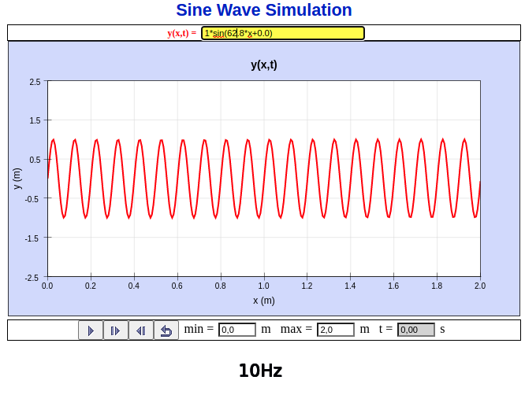

Conceptos básicos
=================

Conceptos básicos de comunicaciones
-----------------------------------

- La información se transmite generalmente en forma de ondas por
cualquier medio que lo permita como cables o aire, incluso por el vacío.

- Las antenas emisoras emiten una señal electromagnética que es captada
por las antenas receptoras.

- Antes de enviarse y al recibirse estas ondas son más o menos tratadas
dependiendo de la tecnología aplicada.

- Las ondas periódicas se representan por dos magnitudes principalmente:
	+ Amplitud
	+ Frecuencia
	
- Luego existen otras magnitudes también necesarias como el periodo, la
velocidad de transmisión, la longitud de onda, etc.

Se estudiarán a continuación estas magnitudes:

### Frecuencia

La frecuencia es cuantas veces se repite una onda en una unidad de 
tiempo, por ejemplo un motor puede girar a 3000rmp o lo que es lo
mismo 50 veces por segundo. En general los ciclos por segundo los
llamamos Hercios y en telecomunicaciones es habitual utilizar prefijos 
de escala como kilo, mega o giga, como por ejemplo 100kHz son 100.000Hz.

Veamos las figuras de dos ondas:

- La primera se repite cada segundo, por lo que tiene una frecuencia de 
1Hz.
- La segunda se repite dos veces cada segundo, por lo que tiene una 
frecuencia de 2Hz
- La tercera se repite diez veces cada segundo, por lo que tiene una 
frecuencia de 10Hz

<figure>
  
  <figcaption>1Hz</figcaption>
</figure>

<figure>

<figcaption>2Hz</figcaption>
</figure>

<figure>

<figcaption>10Hz</figcaption>
</figure>

### Periodo

El periodo es cuanto tiempo tarda el ciclo en repetirse, es la inversa
de la frecuencia, es decir:

Donde:

- **_T_** es el periodo
- **_f_** es la frecuencia

Por ejemplo en las anteriores imagenes. La onda con frecuencia de 1Hz
tiene un periodo de 1 s, la de 2Hz tiene un periodo de 0.5s y la de
10Hz tiene un periodo de 0.1s

### Amplitud

Representa los valores limites de la onda, como de alto o bajo puede 
llegar en el eje vertical. Suele representar la potencia de la onda.

<figure>

<figcaption>A = 0.5</figcaption>
</figure>

<figure>

<figcaption>A = 1</figcaption>
</figure>

<figure>

<figcaption>A = 2</figcaption>
</figure>

**Nota:** Todas estas figuras se generaron con 
[Open Source Phisics](https://www.compadre.org/osp/EJSS/4018/128.htm)

Las unidades serán voltios, amperios, vatios, decibelios. Dependerá
de la magnitud que represente esa onda.

Transmisión de señales
----------------------

La transmisión de señales puede darse por muchos medios. En las 
telecomunicaciones habituales suelen limitarse a aire, cableado o
espacio vacío (en el caso de satélites) mediante ondas 
electromagnéticas.

Pero una señal puede transmitirse de muchos otros modos. Por ejemplo a 
través de ondas de presión por el aire (sonido).

La señal deberá tener una amplitud y frecuencia determinadas según
el medio y la distancia por el que se deben propagar.

Por ejemplo una señal con poca amplitud transmitida a mucha distancia
por el aire se verá atenuada y no será bien recibida por la antena 
receptora. Otro ejemplo seria que la transmisión con frecuencias del 
infrarojo no se propagan bien.

<figure>

<figcaption>Absorcion atmosférica.<a href="http://funnel.sfsu.edu/courses/metr104/F13/summaries/AbsorptionSpectra_Atmosphere.pdf">[fuente]</a> </figcaption>
</figure>

La señal analógica y digital
----------------------------

### Señal analógica

Una señal analógica es la que se utiliza al conectar un micrófono a un
altavoz. 

El sonido captado por el micrófono hace vibrar una membrana 
que a su vez genera una onda eléctrica. Por ejemplo los micrófonos
dinámicos tienen una bobina de inducción cerca de un imán permanente,
esto hace que al vibrar la membrana se induzca una pequeña corriente.

Esa señal eléctrica, la hacerla pasar a través de un altavoz de bobina 
móvil hace el proceso inverso y la tensión variable crea campos 
magnéticos variables que atraen o repelen una bobina móvil conectada a 
una membrana con respecto a un imán fijo.

Un La de un diapasón hace vibrar el aire 440 veces cada segundo, o lo
que es lo mismo 440Hz. Por lo tanto esa será la frecuencia de la onda
eléctrica que se transmitirá por el cable.

Se puede probar mediante un generador de señal conectado a un altavoz 
o también online: <https://signalgenerator.sciencemusic.org/>.

Si conectamos la señal generada por el micro a una antena esta empezará 
a emitir ondas electromagnéticas de esa frecuencia. Y si conectamos
otra antena al amplificador recibiríamos esa señal pero en condiciones
normales no se oiría más que interferencia.

El motivo es que la onda es demasiado débil por una parte y por otra
tiene una frecuencia que no es transmisible por el aire (si recordamos
la imagen de la absorción atmosférica).

El primer problema es relativamente sencillo de solucionar mediante
la amplificación de la señal. El segundo es algo más complejo, y para
solucionarlo se recurre a la modulación de la señal.

En la modulación de señal se tiene: por un lado una onda portadora, que 
es de una frecuencia transmisible; y por otro una onda moduladora, que 
cambia esa señal bien en amplitud, bien en frecuencia.

En el primer caso hablamos de una señal AM (por las siglas de Amplitud
Modulada), en el segundo hablamos de una señal FM (o Frecuencia 
Modulada).

<figure>

<figcaption>Modulación AM y FM</figcaption>
</figure>

La señal de televisión además de sonido debe transmitir imagen. Por lo
que en la época de la televisión analógica en blanco y negro parte del
ancho de banda se utilizaba para llevar una señal portadora de vídeo.
Posteriormente se añadieron otras señales, una para el color y otra
para el sonido estéreo.

Además la señal ya no era tan sencilla, ya que implicaba tiempos de 
retorno del flujo de electrones al acabar una línea y la necesaria 
sincronización entre el método de captación y el método de 
visualización.

A raíz de esto aparecieron numerosos estándares y sistemas el PAL
Europeo y el NTSC americano.

### Señal digital

La señal digital, aunque también usa ondas sinusoidales para 
transmitirse, estas ya no representan posiciones analógicas de los
receptores (tono, volumen, luminosidad). Por contra, cada parte de
la onda representa un símbolo y a su vez cada simbolo representa un
valor discreto, un número entero, que en última instancia puede
representarse como una sucesión de unos y ceros.

Los sistemas utilizados para codificar la señal escapan al alcance de
este curso. Baste decir que se utilizan combinaciones de estrategias
como son variaciones en la amplitud, frecuencia y fase de la onda para
generar símbolos, además de utilizar polarizaciones de la onda y
transformaciones matemáticas (como la transformada inversa de Fourier).

Cada uno de estos unos y ceros es también llamado un bit de información.
Cuanta más información se quiera enviar más bits por segundo deberemos
transmitir.

Si quisiera transmitir cada segundo si una puerta está abierta o cerrada 
una velocidad de transmisión de 1 bit/s sería suficiente. Para un CD de
audio necesitaríamos 1.400.000 bits/s (44100Hz x 16 bits x 2 canales),
aunque si lo comprimimos con mp3 son suficientes 128.000 bits/s.

Para no utilizar tantos ceros suelen utilizarse prefijos de escala.
Así un CD tiene un bitrate (leido bit-rate) de 1.400kbits/s o 1.400kbps,
un mp3 de 128kbps y el del 4k no comprimido supera los 6Gbps.

Con un segundo de video no comprimido podríamos transmitir la misma
información que la de conocer el estado de todas las puertas principales
de todas las casas de la humanidad.

No obstante igual que pasa con el audio de un CD o de un mp3, el video
es comprimido antes de transmitirse.

Al recibirse este código es interpretado por el descodificador y 
transformado en la señal o impulsos que la interfaz (HDMI, VGA) o 
tecnología de visualización (LCD, CRT) requiera.

Como curiosidad, los nuevos sistemas siempre han heredado parte de la
tecnología anterior, bien por compatibilidad, bien por desarrollo
tecnológico. La televisión en blanco y negro heredó la modulación de la
radió, la emisión de TV en color era totalmente compatible con una TV
en blanco y negro, la TDT utiliza las mismas antenas que la TV 
analógica. 
