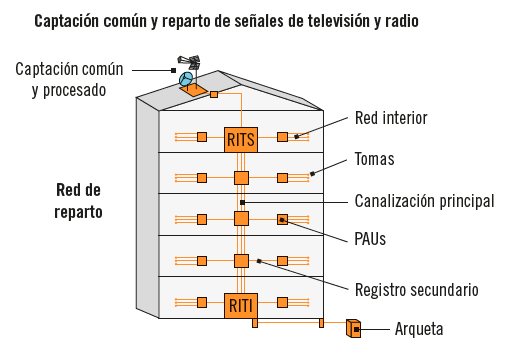
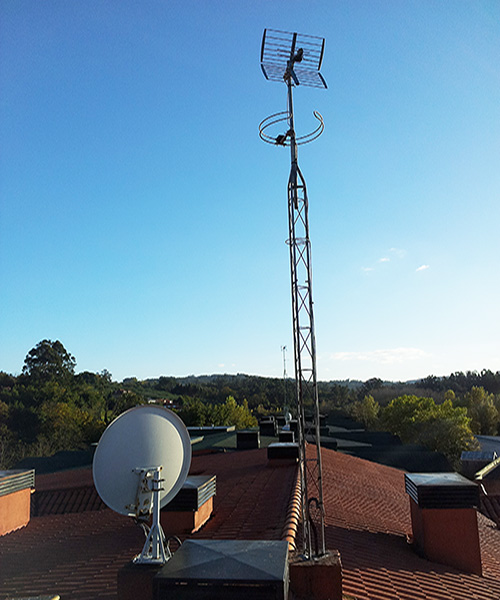
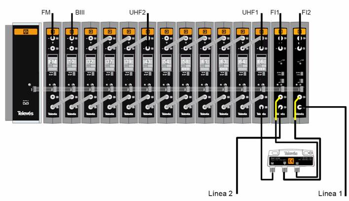
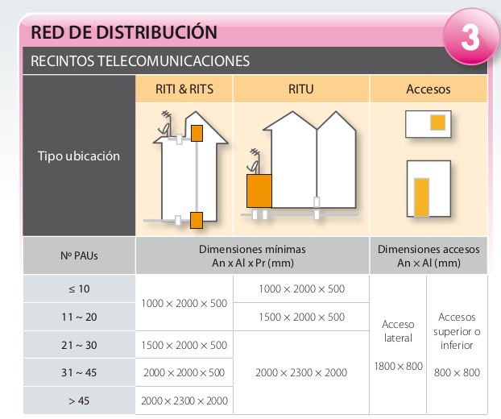
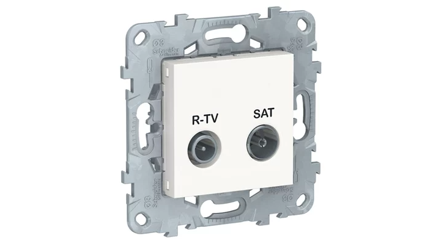

1.- Tipos de instalaciones de telecomunicaciones.
=================================================

Instalaciones de captación y distribución de señales de radiodifusión sonora y televisión.
------------------------------------------------------------------------

Actualmente no se permite la instalación de una antena para cada aparato
o vivienda. Se debe instalar una antena de cada tipo por edificio. Es lo
que se llama instalación colectiva.

Consta de dos partes: un sistema de captación (antenas) y un sistema de
distribución (cables).

### Elementos básicos de una instalación de radio y televisión

Un sistema colectivo estará formado por los siguientes elementos:

- **Captación** Que son el conjunto de antenas para recibir todas las
señales, y los elementos auxiliares necesarios (mastiles, anclajes, 
etc.). Se necesitará por lo general una antena para cada tipo de
servicio (radio, TV, Sat).

- **Cabecera** Es donde se amplifica la señal y se transforma para
adaptarla a su transmisión por cable.

- **Distribución** Es el cableado y cajas por las que discurre la
instalación.

- **Tomas** Son el final de la instalación de distribución y donde los
usuarios conectan sus equipos.

Instalaciones de señales de telefonía y redes locales.
------------------------------------------------------

### Instalaciones de telefonía

Las señales tradicionales de teléfono son analógicas, es decir, un
micrófono crea una señal eléctrica de baja potencia que se transmite 
por un cable (el llamado par de cobre)hasta otro teléfono donde induce 
movimiento a un altavoz que es el que reproduce sonido. 

También permite tecnologías para el envío de datos como el caso del fax
o de los antiguos módems de 56kbps, aunque su velocidad es muy baja y
han caído en desuso frente a otras tecnologías.

La red de telefonía publica, también llamada RTC (red de telefonía 
conmutada) o RTB (Red de Telefonía Básica), se basaba, antiguamente, en 
una estructura de cables que convergían en centrales de conmutación, que 
redireccionaban la señal hacia otra central y de esta a otra o ya al 
usuario final.

Hoy en día parte de estas comunicaciones son digitalizadas y 
transmitidas por otros medios para posteriormente reconstruir la onda
analógica que llega a nuestros teléfonos.

Una última curiosidad es comentar que la alimentación de la señal del
teléfono procede de la central y no de la red eléctrica. Por eso es 
posible utilizar el teléfono a pesar de no tener suministro eléctrico.

Por otra parte desde finales de los 80 se disponía de otra tecnología
que utilizaba la transmisión digital de diferentes servicios. La llamada
RDSI (Red Digital de Servicios Integrados), esta permitía llamadas 
(incluso varias), vídeo y datos por una misma línea. Actualmente esta
red está a extinguir.

### Instalaciones de redes locales.

Las redes locales son aquellas que permiten la transmisión de datos de
un dispositivo a otro, las llamadas LAN (Local Area Network).

Mediante las redes LAN, tenemos conectados todos nuestros PC,
impresoras, cámaras IP, etc. así como el enlace a internet. Estas 
conexiones ya no utilizan el cableado de par de cobre y además precisan
de elementos adicionales como _switches_ y _routers_.

existen diferentes topologías, siendo la más habitual en estrella. Es
decir, todos los equipos se conectan a un mismo punto.

Instalaciones de distribución de señales de telecomunicaciones por cable.
------------------------------------------------------------------------

Son las que reparten todos los servicios de telecomunicaciones del
edificio. Aunque vayan por caminos comunes, cada uno de estos servicios
TV, internet, teléfono, utilizan tubos diferentes y un cableado 
específico.

Hay que tener en cuenta que las señales de TV y radio proceden de la 
azotea. El recinto encargado de recibir la señal de las antenas es
también llamado RITS (Recinto de Instalaciones de Telecomunicaciones 
Superior).

Por otra parte tanto la telefonía como los datos proceden de un cableado 
subterráneo. El RITI (Recinto de Instalaciones de Telecomunicaciones
Inferior) es donde comenzaría la instalación de distribución para estos
dos servicios.

Además existirán elementos adicionales como un derivador (también
llamado multiplicador), y un PAU.

Instalaciones de megafonía y sonorización.
------------------------------------------

Las instalaciones de megafonía y sonorización están constituidas por:

- Entrada (un micrófono, un reproductor, etc.)
- Tratamiento (un amplificador, ecualizador, etc.)
- Salidas (altavoz, megáfono, subwoofer)

Los parámetros principales que definen un sonido son:

- Tono, la frecuencia de la onda que nuestro oído interpreta en como de 
grave o agudo es un sonido).
- Intensidad, la amplitud de la onda que nuestro oído interpreta en como 
de fuerte o flojo es un sonido).
- Duración, el tiempo que dura la onda, o como de largo o corto es el 
sonido.
- Timbre, los armónicos y su peso, que nuestro oído interpreta en si el 
sonido suena a guitarra o a flauta).

Podemos utilizar:

- [el generador de tonos](https://signalgenerator.sciencemusic.org/)
- [generador de onda por síntesis aditiva](https://meettechniek.info/additional/additive-synthesis.html)

Instalaciones de sistemas de portería electrónica, sistemas de videoportería o sistemas de control de accesos.
------------------------------------------------------------------------

Los sistemas de control de accesos y los sistemas de portería guardan 
cierta relación en tanto que se dispone de una placa de calle de acceso
público. Elementos auxiliares (amplificadores, alimentadores y 
teléfonos) y finalmente abrepuertas o similar.

La diferencia es quien autoriza la entrada, si una máquina o una persona
tras una conversación e incluso a veces esta linea es difusa, como por
ejemplo un control de accesos con un pulsador para llamada.

Según la estructura podemos encontrar viviendas unifamiliares, 
plurifamiares, con varios accesos, con conserjería. Según las 
necesidades (con tarjetas magnéticas, codificaciones, videoportero, 
etc.)