Instalaciones de captación y distribución de señales de radiodifusión sonora y televisión.
========================================================================

Identificación de los tipos de complementos utilizados en las instalaciones de captación y distribución de señales de radiodifusión sonora y televisión
------------------------------------------------------------------------

Para dar uniformidad y normalización existe la normativa e ICT 
(Infraestructura Común de Telecomunicación), aprobada por
[RD 346/2011](https://www.boe.es/buscar/act.php?id=BOE-A-2011-5834),
en ella está detallada el diámetro de los tubos, formas de 
distribuirlos, elementos de cabecera, captación, numero de PAUs, tomas, 
etc.

### Canalizaciones

#### Tipos de canalizaciones

En RTV se utilizan 3 tipos de canalizaciones:

- **Tubo corrugado:** Es un tubo flexible destinado a ser empotrado y la
instalación por defecto (siempre que sea posible).
- **Tubo rígido:** Para la instalación superficial.
- **Canaletas:** Para la instalación superficial. Preferido en instalaciones de oficinas, en las que no sea posible empotrar.

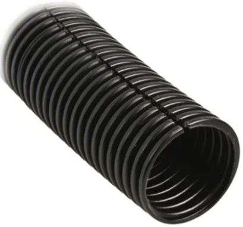
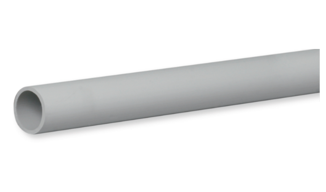
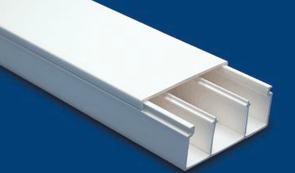

#### Zonas de canalización en edificios

Si nos fijamos en la siguiente imagen, podremos distinguir varias zonas

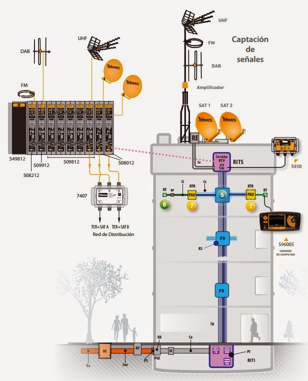

##### Canalización de enlace

En este caso la superior parte del RE (Registro de enlace) y llega al 
RITS (recinto de instalaciones...). Es una canalización muy expuesta al 
exterior, por lo que se prefiere tubos empotrados.

Las condiciones son:

- 4 tubos de 40mm de diámetro
- Canaletas de 6.000mm² con 4 compartimentos.

Se necesitan 4 tubos o 4 compartimentos para 1 cable de TDT, 2 de TV sat
y 1 reserva.

##### Canalización principal

Une los RITS y RITI y se distribuye en 
vertical por la vertical del edificio (normalmente por el hueco de 
escalera). Si por ejemplo se hace por tubos el reglamento indica:

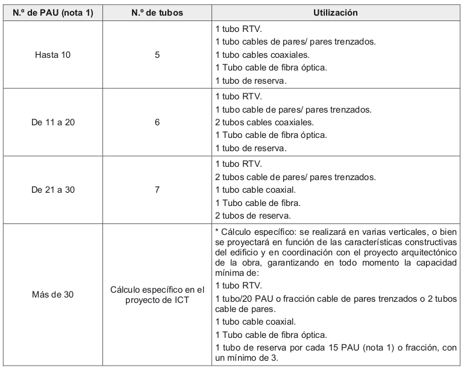

##### Canalización secundaria

Une los registros de la canalización principal con los PAU (Punto Acceso 
Usuario) de cada vivienda. Por lo general está compuesta de 4 tubos:

- Cable de par o par trenzado
- Cables coaxiales de TBA (telecomunicaciones de banda ancha)
- Cables coaxiales RTV
- Cables de fibra óptica

El diámetro de los tubos dependerá de los cables a aloja y numero de
PAU que alimenten.

##### Canalización interior o de usuario

Parte del PAU y termina en las diferentes tomas (TV, Radio, teléfono).
La distribución es con tubos de 20mm (o canales).

##### Redes de canalización

Finalmente se habla de redes de canalización al conjunto de las 
canalizaciones:

- Red de alimentación: la compuesta por tos tubos que llegan hasta el
RITI o RITS.
- Red de distribución: La compuesta por las canalizaciones principales
- Red de dispersión: la compuesta por las canalizaciones secundarias
- Red interior: los tubos que discurren por un local o vivienda.

### Conductores

Para los servicios de RTV. El cableado de referencia es el cable coaxial 
de 75Ω de impedancia (la impedancia es constante ya que no depende de
la resistencia, sino de su inductancia y capacitancia).

Su estructura se compone de 4 capas:

- Nucleo central de cobre (llamado vivo)
- un primer aislante
- Una malla metálica conductora
- Una cubierta protectora también aislante.

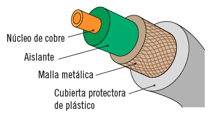

**NOTA IMPORTANTE:** Aunque el coaxial es la elección de preferencia,
se deben tener en cuenta algunas consideraciones:

- Su avería es relativamente sencilla de producirse y difícil de 
detectar.
- No se debe deformar la distancia entre malla y vivo (con bridas muy
apretadas por ejemplo).
- No empalmar los cables. Siempre un único cable sin empalmes o en caso
extremo utilizar conectores.

### Armarios

En edificios de hasta 10 viviendas se puede sustituir el RITI o RITS
de obra por un armario modular metálico con cerradura, conectado a 
tierra, con IP 55 (exteriores) e IP33 (interiores) y con ventilación.

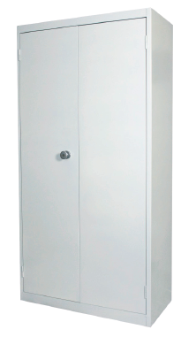

### Racks

Armarios o cajas, destinadas a alojar dispositivo electrónico con medida
normalizada de 10 o 19 pulgadas (donde cada pulgada son 25,4mm). De esta 
manera todos los fabricantes pueden amoldarse a esas medidas.

Cada 3 agujeros frontales fijadores se los denomina U y miden 44,45mm.

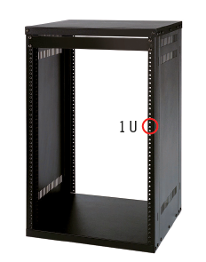

Suelen instalarse en el RITI, aunque también se dispone de ellos en
oficinas de cierto tamaño o instalaciones con un mínimo de complejidad.

### Complementos auxiliares

#### Registros secundarios
Son los que enlazan la canalización principal con las secundarias de
cada planta.

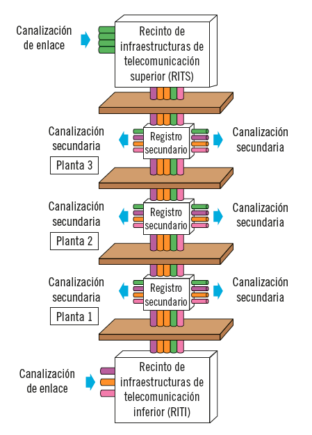

Ubicados en zonas comunitarias y con cerradura. Normalmente de 
450x450x150mm para hasta 20 viviendas por planta

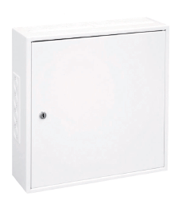
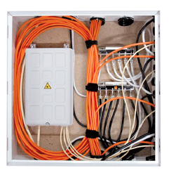

### Registros de enlace

Se instalan cuando la distancia entre las antenas y el RITS es grande,
suelen medir 360x360x120mm

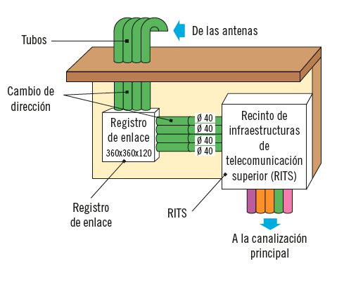

### Registros de paso

En las canalizaciones secundarias (desde la principal hasta las viviendas), en ocasiones se deben instalar registros de paso, son cajas empotradas para ayudar en curvaturas complicadas y también permitir el acceso fácil a puntos intermedios.

Existen 3 tipos:

+ Tipo A: en tramos comunes de canalizaciones secundarias de 360 x 360 x120 mm
+ Tipo B: en tramos de accesos a viviendas y para los servicios de telefonía. De dimensiones 100 x 100 x 40 mm
+ Tipo C: usados en canalizaciones interiores para RTV y satelite de 100 x 160 x 40 mm

### Registros de terminación de red

Son registros que van situados en el interior de cada vivienda u oficina, y empotrados en la pared. Separan la canalización secundaria con la canalización interior de usuario.

Existe uno para cada servicio, y es donde acaban los tubos provinientes de los registros de paso.

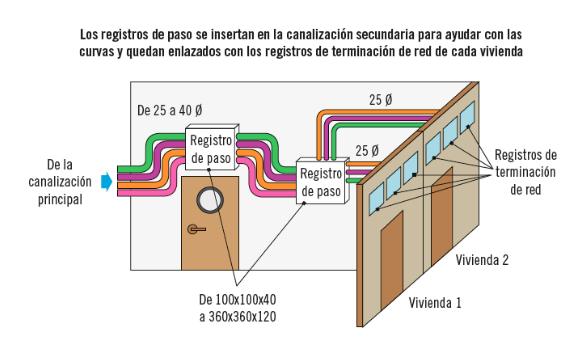

### Registros de Toma o BAT (Base Acceso Terminal)

Pertenecen a la red interior de usuario, son las cajas que tendran las tomas donde se conectaran los equipos. Tendrán 3 compartimentos. Uno para RTV, otro de telefonia y otra para satélite.

Tendrán las siguientes caracteristicas:

+ Van empotrados
+ Las medidas mínimas son 64 x 64 x 42
+ Alejados como máximo 50cm de una toma de corriente.
+ Dispondrán de dos orificios (para tornillos) separados 60mm

Existe una fórmula para saber cuantas de estos conjuntos de registros se deben instalar (como mínimo):

Donde:

+ nr es el número de registros
+ ne es el número de estancias

Clasificación de los elementos de captación (antenas de FM, de UHF, satélite) según su utilización, ubicación y forma
----------------------------------------------------------------------

A continuación se detallan los diferentes tipos de antenas encargadas de captar las señales.

### Antenas de FM

Las antenas de FM se instalan en mástil en la azotea o la parte más alta del edificio. Pudiendo recoger principalmente frecuencias de 87,5 a 108 Mhz.

Las antenas aconsejadas por la norma ICT son omnidireccionales. Con sus ventajas (podrá recibir desde cualquier estación emisora esté situada donde esté situada), y inconvenientes (recibirá mayor número de interferencias).

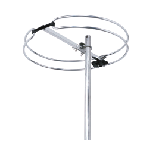

### Antenas de UHF

Están diseñadas para captar señales desde los 470 a los 862 Mhz (denominado UHF Ultra High Frecuency).

La nueva TDT está diseñada para funcionar a la mismas frecuencias que la antigua analógica la banda UHF, por este motivo se han podido utilizar, por lo general, las mismas antenas.

#### Características:

+ **Ganancia:** Medida en decibelios (dB). Es cuanto aumenta la señal la antena por direccionamiento, reflejo y concentración.
+ **Ancho de banda:** Es el rango de frecuencias en las que la antena capta (470-862).
+ **Directividad:** Medida en grados, ya que al contrario que las FM las UHF tienen directividad (por esto es que hay que apuntarlas al repetidor), pero tambien tienen menos interferencias. Hay dos parametros que determinan dicha directividad.
	* **Ancho de haz:** Abertura en grados del lóbulo principal.
	* **Relación adelante/atrás:** Relación entre la ganancia del lóbulo principal y la ganancia de los lóbulos de la parte posterior.
	

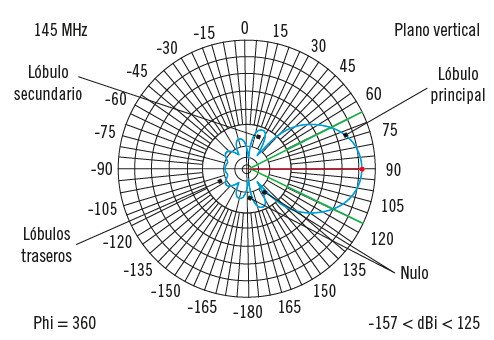

#### Componentes:

+ **Dipolo:** también llamada caja de la antena. Su misión es convertir las ondas en pulsos. También puede coexistir un adaptador de impedancias, que equilibra la impedancia del dipolo (300Ω) con la del cable coaxial (75Ω).
+ **Elementos directores:** Son unas piezas metálicas alineadas. Encauzan las ondas recibidas hacia el dipolo para que todas converjan en el.
+ **Elementos reflectores:** Formadas con parrillas metálicas que actuan como pantalla al paso de las ondas. Bloqueando lo que vienen por detrás y reflejando lo que viene por delante.

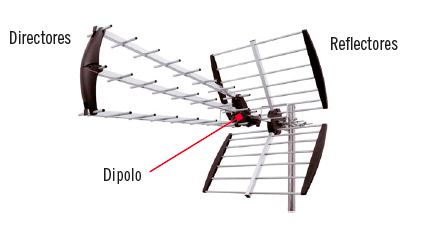

#### Tipos de antenas UHF

Existen diferentes tipos de antenas UHF que se adaptan a cada tipo de circunstancias:

+ **Yagi** Ofrecen muy buna directividad pero no captan toda la banda UHF

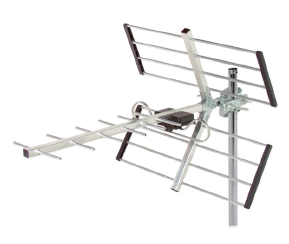

+ **DAT** Siglas de Digital antena Terrestrial. Diseñadas para optimizar la recepción de la TDT. Presentan mayor numero de barras receptoras. Captan más ancho de banda y mejoran en ganancia.

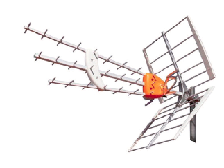

+ **Antena de panel** Peor ganancia y menor directividad, pero son más económicas

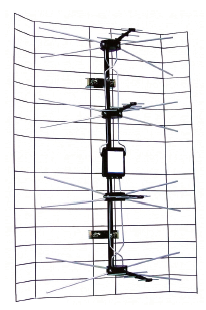

+ **Antena logarítmica:** Diseñadas para la banda VHF (antigua televisión), tenían poca directividad y ganancia.

+ **Antena parabólica:** Diseñadas para la recepción de emisiones desde el satélite, están compuestas por:
	* **Reflector parabólico:** Las geometrías parabólicas poseen un punto llamado foco donde se concentran las líneas paralelas al eje.
	* **LNB (Low Noise Block)** También llamado alimentador o iluminador. Recibe las señales reflejadas en el plato parabólico y las adecúa (pasa de las señales de alta frecuencia del satélite a señales de baja frecuencia que el cable coaxial puede transmitir) para transmitirlas en la red de distribución interior. Se sitúa en el foco del receptor parabólico.
	
	
Identificación de los elementos de cabecera y distribución.
-----------------------------------------------------------

### Amplificadores

Estos dispositivos amplifican la señal recibida con el fin de que llegue al nivel óptimo a las tomas de los usuarios.

A pesar de que como ya se ha explicado la antena realiza una primera amplificación, pero es necesaria una segunda amplificación para que las perdidas que sufrirá la señal por todo el cableado no presenten problemas a la hora de recibir la señal.

El máximo permitido por la normativa son 113dBµV a la salida de la cabecera (con un BER inferior a 9 x 10⁻⁵)

#### Tipos

+ **Amplificadores de banda ancha:** Instalados en las instalaciones individuales de televisión. Se instalan después del mezclador, aunque ya existen muchos modelos que están integrados amplificador + mezclador.
Se denominan de banda ancha porque amplifican todas las frecuencias de la banda UHF. El inconveniente de estos amplificadores es que amplían todas las bandas (las que necesitan poca amplificación y las que necesitan mucha), así como a las interferencias y canales vacíos.

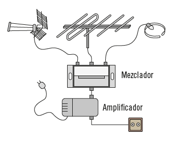

+ **Amplificadores de banda estrecha:** Amplifican un rango muy específico de frecuencias, y sólo amplia los canales seleccionados.
Se dividen en grupos, los también llamados monocanales y son los que se instalaran en instalaciones colectivas de televisión.

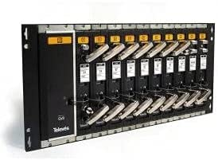

### Mezcladores

Estos dispositivos se encargan de mezclar por un único cable las señales que provienen de distintas antenas o distintos monocanales.

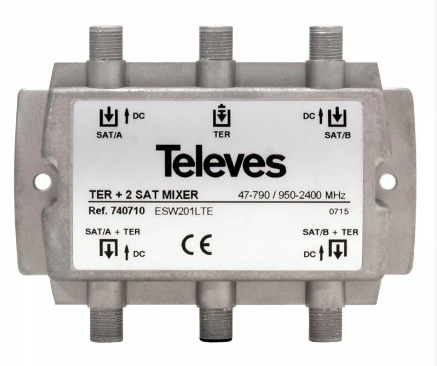

De esta manera se distribuye la menor cantidad de cableado posible, combinando la señal de TV radio y satélite en un único cable coaxial.

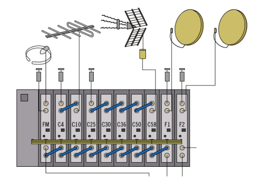

### Filtros

Suelen estar integrados en los propios dispositivos amplificadores, y filtran las frecuencias no deseadas, encontrándose los filtros pasa banda y los filtros rechazadores.

### Atenuadores

Poco utilizados en general disminuyen la potencia de señal por debajo del máximo por normativa (113dB en cabecera) y de 45 a 70dB en las tomas.

### Ecualizadores

Atenúan sólo las frecuencias para las que fue programado.

### Repartidor

También llamado Spliter y Distribuidor. Es el encargado de dividir la señal en varias señales.

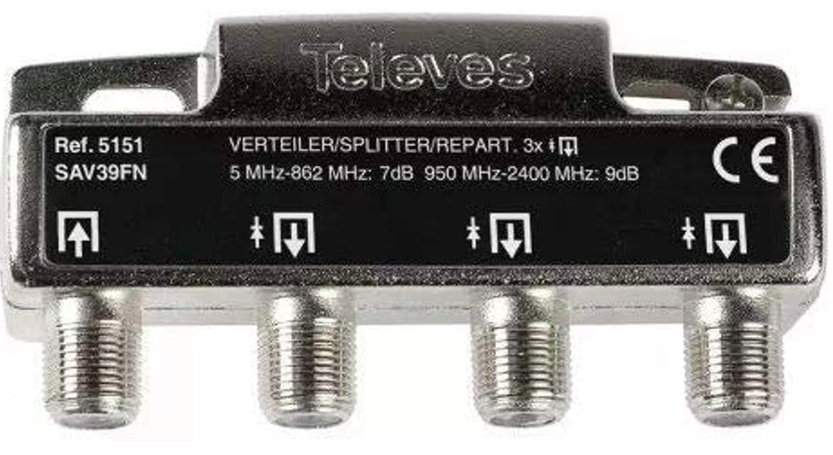

Lo podemos encontrar combinado con otros elementos.

### Derivador

Son similares a los repartidores, aunque a diferencia de estos donde todas las salidas tienen la misma perdida. Tienen dos tipos de salida con perdidas diferentes:

+ Perdidas de paso: Producidas por el maso por el derivador hacia una planta inferior
+ Perdidas de derivación: producidas por las derivaciones en la misma planta.

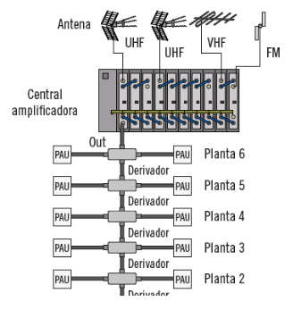

### PAU (punto de acceso al usuario)

Se trata del elemento que separa lo que es de la comunidad o lo que es del usuario final, además debe disponer de dos entradas una para Terr+SAT 1 y otra de terr+SAT 2. Y una de las dos muere en el PAU, la otra se distribuye a la vivienda

Originalmente esto era así porque las principales plataformas de televisión por satélite de España podían recibir desde Hispasat o desde Astra. En tal caso, no sería necesario más que intercambiar el cable de entrada por el otro.

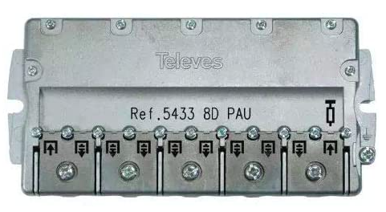

Localización de la ubicación de los elementos de distribución
-------------------------------------------------------------

### RITS

En este cuarto estarán los:

+ Amplificadores
+ Alimentadores
+ Mezcladores
+ Filtros
+ Atenuadores
+ Repartidor

### Registros secundarios

En ellos encontraremos los derivadores, ya que hay un registro secundario por cada planta

### Registros terminadores de red

Existe un registro por cada servicio. En el correspondiente a RTV es el lugar donde se ubicará el PAU. Normalmente en la entrada de la vivienda, cerca de la puerta.