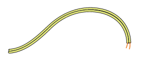
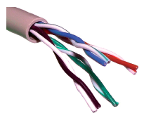
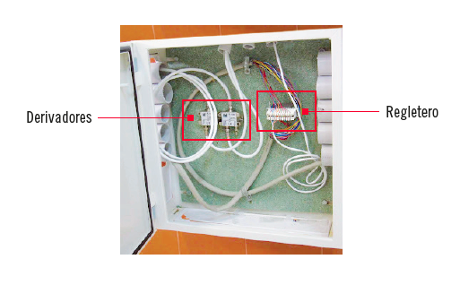
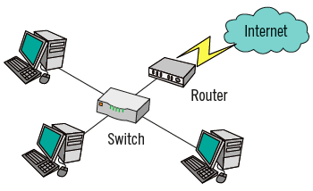
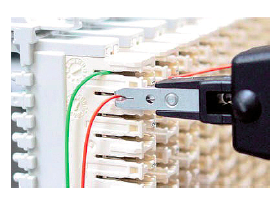
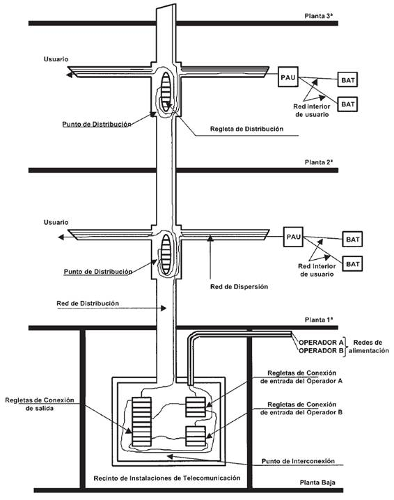
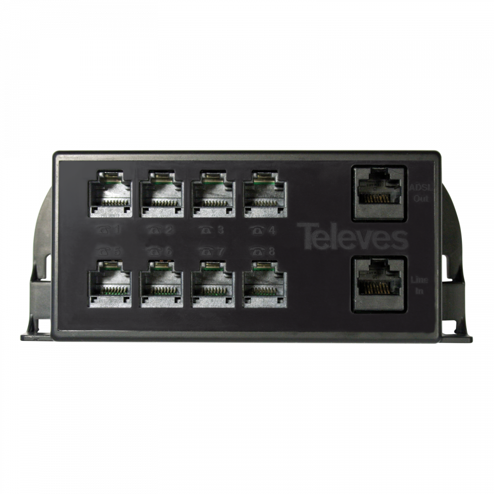
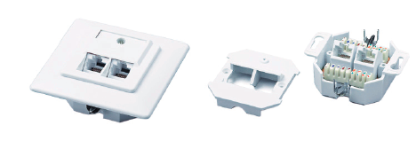
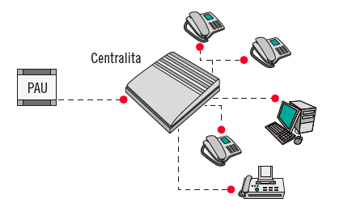

Instalaciones de telefonía y redes locales
========================================================================

Identificación de los tipos de canalizaciones, conductores, armarios, cajas y complementos auxiliares según su uso y localización
------------------------------------------------------------------------

### Tipos de canalizaciones. Zonas de canalización y redes

#### Tipos

Al igual que en el capítulo interior existen tres tipos de canalizaciones:

+ Tubo corrugado
+ Tubo rígido
+ Canaletas

Siendo el tubo corrugado y las canaletas la opción de preferencia para entornos domésticos o de oficinas. Y dentro de estas dos se prefieren instalaciones empotradas.

#### Zonas de canalización

La siguientes canalizaciones son comunes a toda la instalación e interior son comunes a todas las instalaciones singulares:

+ **Canalización principal:** Une RITS y RITI y se distribuye en vertical por el edificio. Sus tubos son de Ø50mm, y su número depende del número de viviendas.
+ **Canalización secundaria:** Empieza en los RS de cada planta y termina en los RTR
+ **Canalización de interior:** Empieza en el RTR y termina en los BAT

#### Redes de canalización

+ **Red de alimentación:** Introduce los servicios hasta el RITI o el RITS
+ **Red de distribución:** Constituida por la canalización o canalizaciones principales
+ **Red de dispersión:** Encargada de enlazar la canalización principal con las viviendas. Es el conjunto de redes secundarias
+ **Red interior de usuario:** La constituida por las canalizaciones interiores.

### Tipos de conductores

Se deben distinguir en este capítulo dos zonas:

+ Distribución por edificio
+ Distribución por redes interiores de usuario

#### Conductores de red de alimentación y red de distribución

Estas dos redes (la que recibe las señales desde la calle y la distribuida en la canalización principal), son las que más cantidad de señales deben soportar por lo que su cableado tendrá mayor número de conductores.

##### Cable multipar

Cuenta con un gran número de conductores para dar servicio a un gran número de usuarios.

Puede estar compuesto por 12, 25, 32 y 50 pares de cobre pudiendo dar servicio a ese número de usuarios. Aunque de todas formas se distribuyen cables con más conductores de los necesarios para:

+ Imprevistos
+ Ampliaciones
+ Averías

De hecho la ITC recomienda cables ocupados en un 70%

#### Conductores de red de dispersión e interior
Ya no se necesita repartir tantos pares por lo que con cableado de uno o dos pares es suficiente.

##### Cable bifilar simple

Está compuesto por dos pares. Mallado (disminuye las interferencias), solía usarse visto, sin canalizar.

Existe un modelo de este cableado, el llamado paralelo bifilar simple, son dos cables aislados unidos entre si en paralelo. Suelen ser de color crema.

##### Cable plano

La forma del aislante es plana. Contiene de 2 a 8 hilos de cobre en su interior.

De esta forma con un único cable podríamos tener los 2 pares que aconseja la norma hasta una vivienda u oficina.

Y también para algunos servicios interiores como centralitas, fax, etc.

##### Cable par trenzado

Está formado por 8 hilos trenzados de 2 a 2. También llamado cable Ethernet o o UTP (Unshielded Twisted Pair, par trenzado no blindado).

Suele utilizarse para la red de área local. Aunque al ser de cobre también puede usarse para telefonía. Aunque no es lo habitual.

EL orden y uso de cada par depende del estandar utilizado así, por ejemplo con el estandar EIA/TIA 568B, el orden sería blanco-naranja, naranja, blanco-verde, azul, blanco-azul, verde, blanco-marrón, marrón.

Hay que saber si un cable sigue una norma u otra o de lo contrario la red no funcionará.

### Tipos de armarios y cajas racks

Los armarios y racks utilizados en telefonía son muy similares a los de RTV.

#### Armarios

Los armarios del RITI están destinados básicamente al conexionado de la red exterior con la red interior. Pudiendo incluso sustituir al RITI en algunos casos.

Además para segun que tipo de configuraciones de viviendas (unifamiliares adosadas). es posible que el RITS y el RITI se unifiquen dando lugar al RITU. Finalmente en caso de que la instalación sea de poca envergadura el RITU puede ser un RITM (Recinto de Infraestucturas de Telecomunicaciones Modular).

#### Cajas Racks

Al igual que con RTV son armarios o cajas con unas medidas muy concretas y preestablecidas, lo cual permite la instalación de equipos "enracables"

### Complementos auxiliares

#### Complementos comunes

Ya estudiados y solamente se nombrarán:

+ Registros Secundarios

+ Registros de paso
+ Registros de terminación de red

#### Complementos propios de instalaciones de telefonía

El único que podría encajar aquí sería el encargado de convertir de analógico a digital para acceder a los antiguos servicios de RDSI. Aunque estos tipos de servicios estan prácticamente en desuso.

#### Complementos propios de instalaciones de telefonía.

Una vez pasado el PAU de telefonía se puede acceder a los servicios de banda ancha ADSL (Asymmetric Digital Suscriber Line, o linea de abonado digital asimétrica). Para ello se necesitan los siguientes equipos:

##### Modem

Viene de la contracción de MOdular DEModular, connvierte la señal recibida del ISP (Internet Service Provider, proveedor de servicios de internet) a señal digital apta para una red LAN.

##### Conmutadores o switches

Permiten interconectar todos los equipos de una subred.

##### Router enrutador

Es un dispositivo que permite conectar dispositivos don diferente prefijo.

En general los routers domésticos tienen integradas otras funciones como:

+ Modem: para convertir las señales
+ Punto de acceso: Para proveer de wifi a los dispositivos
+ Switch: para conectar varios dispositivos a través de cable, creando una red local.

Clasificación de los elementos de distribución según su ubicación.
------------------------------------------------------------------

### Elementos distribuidores en la red de distribución

#### Regletas

Se utilizan ampliamente las denominadas regletas o regleteros. Hacen de puntos de interconexión entre la conexiones de entrada y las conexiones de salida, así como las conexiones en los registros secundarios.

El conexionado a estas regletas se hace mediante la crimpadora de impacto.

Deben conectarse los dos hilos de un par en un borne superior y dos en un borne inferior.

Existen las siguientes regletas o regleteros:

+ Regletas de interconexión (colocadas en el RITI)
	- Regletas de conexiones de entrada
	- Regletas de conexiones de salida
* Regletas de distribucion (colocadas en el RS)

#### PAU

Al igual que en otras instalaciones el PAU es el punto de entrada de la red en nuestra casa.

Los nuevos multiplexores RJ45, sustituyen a los antiguos PTR (que a su vez sustituían a los PCR).

Los multiplexores no utilizan conexiones RJ11 si no RJ45, por lo que se deberá tener en cuenta

Al exceder el número de posiciones el par deberá ser concordante en todas las conexiones.

#### BAT

Anexas a las otras tomas de telecomunicaciones.

#### Centralitas

Las centrales telefónicas derivan multiplican y distribuyen el cableado interior de viviendas u oficinas. Se conectan a la línea exterior y a todos los dispositivos a los que se quiera dar servicio.

Identificación de los elementos de la red de alimentación según su utilización y ubicación.
------------------------------------------------------------------------

### Arqueta de entrada

Arqueta de hormigón prefabricado o de fábrica de obra, enterrada en la vía pública.

La ICT prescribe unas medidas según el número de usuarios, siendo la más comun 400x400x600mm (LxAxP), para hasta 20 viviendas.

### Registros de enlace inferior

Al igual que RTV se utilizan cuando las distancias son importantes o cuando hay cambios bruscos de dirección.

