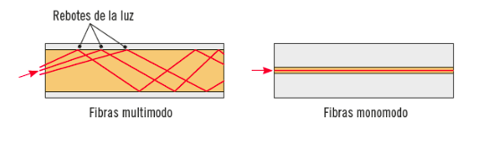
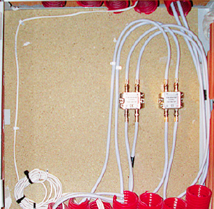

Instalaciones de señales distribuidas por cable
========================================================================

Este tipo de señales también llamadas TLCA, son las encargadas de distribuir TV o bien datos. Es la última de las instalaciones bajo normativa ITC de este módulo.

Identificación de los conductores utilizados en la distribución de las señales de cable
------------------------------------------------------------------------

En cuanto a recorrido este tipo de instalación es análoga a la de telefonía ya estudiada. La principal diferencia es el tipo de cableado.

Se utiliza cableado coaxial tanto para TV como para datos de banda ancha.

Por otra parte la fibra óptica ofrece una velocidad de transmisión de información un escalón por encima y está llamada a ser el futuro de las telecomunicaciones por cable.

### Fibra óptica

Ofrece mayor velocidad y mayores distancias que cualquier otro tipo de cable del mercado.

Su instalación es compleja y un coste más elevado.

La fibra óptica transmite luz de un punto a otro, curvándola si es preciso y con un radio de giro determinado.

Por lo que se necesitarán conversores de luz a impulsos eléctricos y viceversa para servir a las redes locales interiores.

#### Composición
La fibra óptica está compuesta por las siguientes capas de materiales:

+ **Núcleo:** consiste en un cilindro de fibras vidriadas, extremadamente delgado por donde viaja la luz.
+ **Revestimiento:** cubre al núcleo y otorga robustez a las transmisiones
+ **Cubierta:** da protección mecánica al núcleo y revestimiento y lo aísla de la siguiente capa.
+ **Fibras protectoras:** son las principales encargadas de dar resistencia mecánica al conjunto.
+ **Funda del cable o cubierta exterior:** Constituye la última envolvente del cableado impide que se disgregue y además ofrecen protección a las capas interiores al tender el cable.

#### Modo de propagación

+ **Fibra multimodo:** La luz sigue varias trayectorias posibles para la luz en el núcleo. De fabricación más sencilla, aunque permiten distancias menores.
+ **Fibra monomodo:** Solo ofrecen un camino posible a la luz. Por lo que las distancias serán mucho mayores, aunque a un costo elevado.

#### Ventajas y desventajas

<table>
  <tr>
    <th>Ventajas</th>
    <th>Desventajas</th>
  </tr>
  <tr>
    <td>
      <ul>
        <li>Mayor velocidad</li>
        <li>Cableado multiservicio</li>
        <li>Sin interferencias eléctricas </li>
        <li>Apto para instalaciones ATEX</li>
        <li>ligero y de dimensiones reducidas</li>
        <li>materias primas abundantes</li>
      </ul>
    </td>
    <td>
      <ul>
        <li>Material delicado, su instalación es difícil</li>
        <li>Despliegue lento</li>
        <li>Conste de instalación elevado</li>
        <li>Mantenimiento complicado</li>
      </ul>
    </td>
  </tr>
</table>

### Coaxial

Ya se estudió como estos cables a parte de señal analógica también son capaces de transmitir datos con un elevado ancho de banda. La instalación es muy similar a la de ADSL y a la de la fibra óptica en tanto que la instalación común llega a los routers-módems donde se procesa la señal y se distribuye por los circuitos locales mediante cableado UPT y red wifi.

Además su instalación también en similar a RTV en lo que a dispositivos se refiere, ya que se utilizan distribuidores, repartidores, mezcladores, etc. PAUs (que será básicamente un repartidor).

Las precauciones con este tipo de cableado son similares a ñas de RTV:

+ No someter al cable a más de 90° de giro.
+ No deformar la distancia entre malla y vivo.
+ No empalmar nunca los cables

Localización de la ubicación de los dispositivos y cajas (RITI, registro principal) de entrada de la señal de cable
---------------------------------------------------------------------

El cableado de fibra óptica o coaxial recorrerán los mismos registros que otras instalaciones:

+ **Arqueta de entrada:** Por lo general es el mismo recinto que para telefonía, un recinto de hormigón armado enterrado en acera.
+ **Cajas de registro de enlace inferior:** Para tramos excesivamente largos y cambios de dirección. De medidas 450x450x120mm
+ **Registro principal:** Ubicado en el RITI

Identificación de los tubos y registros para la distribución de la señal de cable en el edificio
-----------------------------------------------------------------------

### Tipos de canalizaciones

Son los mismos que para otras instalaciones:

+ Tubo corrugado
+ Tubo rígido de PVC
+ Canaletas
+ Bandejas

### Despliegue de tubos en las canalizaciones

Aunque cada instalación va por tubos distintos, su topología es la misma.

+ Canalización principal
+ Canalización secundaria
+ Canalización interior o de usuario

### Registros usados en la distribución de TLCA

+ **Registro secundario:** donde estarán los derivadores.
+ **Registros de paso:** Cajas empotradas para que pasen los cables.
+ **Registros de terminación de red:** Para coaxial se procede de manera similar a RTV, para fibra óptica se coloca una roseta de fibra con dos conectores SC-APC, donde solo habrá una activa, la otra (que llegará sólo hasta el RITI) será reserva.