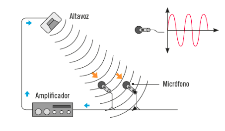

Instalaciones de megafonía y sonorización
========================================================================

No existe normativa explícita que imponga un criterio. Además estass instalaciones.

Localización de los elementos que forman parte de una instalación de megafonía y sonorización
----------------------------------------------------------------------

Las 3 etapas básicas de un equipo de megafonía son:

+ Entradas (microfono o reproductores)
+ Tratamiento eléctrico (amplificación, equalización)
+ Salidas (altavoces)

### Fuentes musicales

Son los dispositivos que se encargan de la reproducción de audio.

#### Tipos

##### Reproductor de CDs
Los reproductores de CDs siguen utilizándose dada sus buenas características:

+ Excelente calidad de audio
+ Sonido sin interferencias
+ Existen reproductores multidisco, lo que permite una reproducción sin interrupciones
+ No necesitan mantenimiento

##### Reproductores MP3 (o similares)

Reproducen audio digital con una calidad similar a la del CD. Se pueden grabar archivos mp3 en un soporte ótico, pero este CD o DVD será de datos, no de audio. Sus características son:

+ Alta calidad de sonido
+ Tamaños de reproductor muy pequeños
+ Gran capacidad de almacenamiento
+ No requieren la inserción de un soporte físico
+ Intuitivos de usar
+ Muy buen precio

##### Sintonizadores de radio

Cualquier radio convencional cumple con esta función, sus características son:

+ Bajo precio
+ Sin coste de mantenimiento
+ No es preciso actualizar la base de datos musical
+ Interferencias y baja calidad del audio
+ Alta presencia de publicidad

##### Equipos Hi-Fi

Aunque pruebas de doble ciego, en general han demostrado no justificar el precio de algunos de los equipos de alta fidelidad, la realidad es que estos equipos siguen teniendo un buen mercado. Los fabricantes de estos equipos afirman poder reproducir las grabaciones con un sonido casi exacto a la realidad.

Sea como sea, un equipo musical en general será un equipo Hi-Fi atendiendo a la definición del término. Constan de varios reproductores ya estudiados y algunos más (considerados vintage) como tocadiscos cassetes y equalizadores.

### Microfonos

Es el encargado de la captación de sonido. Existen muchos modelos cada uno utiliza un principio físico que reacciona a los cambios en la presión producidos por el sonido.

El dispositivo recoge la señal acústica y la convierte en impulsos eléctricos.

Las características más reseñables de un microfono son:

+ **La sensibilidad:** Como de grande va a ser la onda generada a partir de un nivel de potencia dado y cual es el sonido mínimo que es capaz de captar.
+ **Distorsión:** Cuanta fidelidad hay en la onda eléctrica respecto a la onda acústica captada. No existe la distorsión 0.
+ **Directividad:** Desde donde se captan la mayoría de ondas acústicas:
	- Omnidireccionales: Captan desde todas las direcciones
	- Direccionales: Captan preferentemente en una dirección

#### Tipos de microfonos

+ Fijos (incluyendo los de avisos, atril, conferencias, templos etc.).
+ Móviles (entrevistas, exposiciones), están dotados de un micro inalámbrico y un receptor

#### Colocación de los microfonos

##### El pop

En general los golpes súbitos de aire afectan negativamente a los micrófonos. Por ejemplo al pronunciar ciertas consonantes como la P y la T. Por ello este efecto se llama "*pop*". Suele poder evitarse colocando el micrófono a más e 10 cm

##### Acoplamiento

Se produce cuando el sonido emitido es vuelto a captar por el micrófono, y vuelto a amplificar y reproducir, con desfases y distorsiones hasta que el sistema satura.

Las soluciones pasan por colocar los micófonos más lejos o menos en la trayectoria de emisión de los altavoces y utilizar micrófonos muy direccionales.

### Altavoces
Son los principales componentes d ela tercera etapa, se encargan de transformar el impulso eléctrico recibido en ondas de presión.

#### Características básicas

##### Impedancia

Es la resistencia que opone un elemento a la circulación de la corriente eléctrica.

En una instalación de megafonía debe existir cierta homogeneidad entre las tres etapas que componen el sistema. Por ejemplo si la resistencia equivalente de todos los altavoces es de 8Ω.

En este capítulo no se considerarán las impedancias inductivas y capacitivas, si no sólo las resistivas. No obstante para un resultado óptimo debe realizarse el cálculo con todas ellas.

Para calcular la resistencia equivalente en serie se aplicará la siguiente fórmula:

<blockquote>

</blockquote>

Para las resistencias en paralelo:
<blockquote>

</blockquote>

No obstante si agrupamos las resistencias en paralelo de 2 en 2 la fórmula a aplicar es:

<blockquote>

</blockquote>

##### Angulo y derictividad

El ángulo es la apertura horizontal en la que el altavoz puede emitir sonido. La directividad es en cuantas direcciones emite el sonido el altavoz.

#### Conexionado de altavoces

Es de gran importancia el cómo se conectan los altavoces, ya que dependiendo de ello un sistema tendrá una impedancia u otra.

Existen:

+ Conexión en serie (suma de impedancias)
+ Conexión en paralelo (suma de impedancias inversas)
+ Conexión mixta (serie-paralelo). Se deberá agrupar las impedancias de dos en dos e ir simplificando el sistema

### Amplificadores

El objetivo del amplificador es la de aumentar la potencia de la señal eléctrica recibida desde la etapa 1.

Cuando damos volumen a un reproductor (del coche, portátil, etc.) lo que estamos haciendo es aumentar la potencia del mini apmplificador integrado.

El amplificador por lo general posee varios tipos de entradas de audio para poder conectar los diferentes equipos, así como salidas para conectar los altavoces con la topologia deseada sin que existan problemas de desajustes (desadaptaciones) de impedancias.

+ [ejemplo amplificador](https://lafargayherranz.com/comprar/rotel-a12/)

+ [ejemplo altavoces](https://lafargayherranz.com/comprar/bowers-wilkins-707-s2/)

### Ecualizadores y mezcladores

En equipos grandes son independientes, aunque en pequeños suelen estar integrados en el amplificador.

El mezclador se utilizaría para unir dos señales independientes, como micrófono e hilo musical o mensajes periódicos, con sonidos de ambiente.

Un ecualizador es un dispositivo que modifica el nivel del contenido en frecuencias de la señal que procesa. Para ello modifica las amplitudes de sus coeficientes de Fourier, lo que se traduce en diferentes niveles para cada frecuencia. Con esto se puede variar de forma independiente la intensidad de los tonos básicos.

Diferenciación de los distintos tipos de canalizaciones, conductores, cajas y complementos auxiliares según uso y localización
---------------------------------------------------------------------

### Canalizaciones

No difieren a las del resto de instalaciones singulares:

+ Tubo corrugado
+ Tubo rígido
+ Canaletas

### Conductores

El cable utilizado se compone de dos conductores de cobre trenzados. Cada conductor transporta la señal de audio de un canal.

En general son de color negro y rojo. Deben garantizar la no propagación de la llama y tener buen aislamiento eléctrico (600V).

La distancia máxima entre amplificador y micrófono o fuente no debe superar los 80m o utilizar modelos bajo norma GZ-924 o GZ-923.

No es recomendable utilizar la misma canalización para la señal que viene del micro con la que va hacia los altavoces.

Finalmente no se deben utilizar tampoco las otras canalizaciones existentes (como la eléctrica y de comunicaciones)

### Cajas

Son los elementos que contienen los altavoces, tambien denóminado como caja acústica o bafle.

Son esenciales en tanto que las vibraciones de los altavoces también se propagan hacia atrás. Las cajas se encargan de evitar el cortocircuito acústico y la propagación no deseada.

#### Tipos

+ **Caja abierta:** Sencilla y barata, presentan aperturas posteriores.
+ **Caja cerrada:** Sin apertura y de material absorbente.
+ **Sintonizadas o _bass-reflex_:**con aperturas delanteras. La solución más profesional.

### Conectores

+ **Cannon o XLR:** Robustez y fiabilidad, sobretodo en micrófonos

+ **Jack:** Conector de altavoces por excelencia. Existen varias medidas (los más habituales de 3,5mm y 6,5mm).

+ **RCA:** Habitual en equipos que también tienen video (consolas, televisores y cámaras) es también muy utilizado en audio.

Ensamblado de terminales en las instalaciones de megafonía y sonorización según su utilización en los diferentes equipos.
----------------------------------------------------------------------

### Adaptación de impedancias

Las impedancias de cada etapa deben ser similares, o si los equipos lo permiten encontrarse dentro de los rangos admisibles:

1. Si la impedancia de los altavoces es inferior a la impedancia de salida de los amplificadores no se escuchará sonido.
2. Si es igual funcionarán idealmente y a máxima potencia
3. Si la impedancia de los altavoces es superior a la del amplificador el sistema funcionará pero no a máxima potencia.

### Factores influyentes tras el ensamblado

Se describen brevemente algunos factores que influyen en el resultado final y que  no son achacables al conexionado.

#### Propagación del sonido

El sonido se reduce en circunstancias de igual propagación con el cuadrado de la distancia.

La propagación direccional utiliza mejor la potencia emitida.

#### Condiciones atmosféricas

+ Las tormentas inducen corrientes en los cables que distorsionan la señal.
+ El viento desplaza las ondas de sonido en su dirección

#### Presencia de obstáculos

Absorben parte de la energía del sonido, o la reflejan dependiendo de su coeficiente de absorción

##### Difracción

Es cuando la onda crea nuevos frentes de onda debido a la presencia de pequeñas aperturas u obstáculos

##### Eco

Son repeticiones de la mismo sonido, desfasado y atenuado por frecuencias.
Se percibe como una interferencia acústica.

Mecanizado y colocación de cajas
--------------------------------

### Conexión directa

En ellos se conecta directamente el cable ya que no disponen de tomas.

### Conexión por borne

El terminal se conecta al cable a través de un borne

### Colocación altavoces

En cuanto a las frecuencias se debe considerar que las esquinas favorecen las notas graves, las cortinas absorben los agudos.

La distribución de los altavoces debe ser homogénea y equidistante.

Las hojas técnicas definen la superficie de audio que cubre un altavoz y en base a ello, a la superficie del local y a su altura podremos deducir la separación entre altavoces mediante esta tabla:

Acabado y colocación de tapas y embellecedores
----------------------------------------------

En general los equipos estarán provistos de agujeros o resortes para acoplar tapas o embellecedores bien mediante presión, bien mediante el uso de alguna herramienta.

Es importante su correcta colocación no sólo por estética si no también para evitar la manipulación de sus componentes interiores.