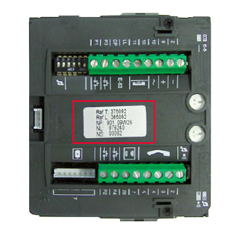

Instalaciones de sistemas de control de accesos
========================================================================

No existe normativa explícita que imponga un criterio. Además estass instalaciones.

Clasificación e identificación de los elementos (placa de calle, terminales de usuario, fuente de alimentación, amplificador, abrepuertas).
----------------------------------------------------------------------

A continuación se realizará una primera aproximació de los elementos que conforman la instalación:

+ Elementos de intercomunicación: Convierten las señales recibidas (audio, huella dactilar, código numérico, etc.).
+ Elementos de alimentación: Destinados a proporcionar la corriente con el voltaje adecuado a todos los dispositivos. Aquí encontraríamos a:
	- Las fuentes de alimentación
	- Los amplificadores
+ Elementos mecánicos: Como abrepuertas o motores de barreras.

### Placa de calle

Donde se encuentran los pulsadores, micrófono y altavoces. Comunica el exterior del edificio con cada uno de los terminales. Pueden ser modulares y permitir ampliaciones para grandes edificios, o bien utilizar un sistema de código para contactar con la vivienda deseada.

Algunos llevan incorporada cámara para poder ver además de oír. Son los llamados video-porteros.

### Terminales de usuario

Son los que permiten recibir llamadas desde dentro del edificio (también llamados telefonillos).

Como mínimo, llevan altavoz, micrófono y un botón para abrir la puerta.

### Fuente de alimentación

Suministran la corriente eléctrica necesaria en voltaje y tipo. Suelen ser de 12, 15 o 18V y de corriente alterna o continua.

### Amplificador

Del mismo modo que en otras instalaciones repite la misma señal recibida pero con mayor intensidad, además permite ciertos ajustes para reducir ruido o aumentar el volumen.

Suele estar integrado en otros elementos.

### Abrepuertas

Parte mecánica del control de accesos. Basado en pulsos eléctricos originados en los telefonillos.

Preparación y ensamblado de los elementos que constituyen las instalaciones de control de accesos (placas de calle, telefonillos, cámaras, alimentadores/amplificadores, entre otros)
----------------------------------------------------------------------

El sistema más sencillo es el compuesto por:

+ Placa de calle
+ 1 o 2 telefonillos
+ 1 abrepuertas
+ 1 fuente de alimentación

Cuantas más funcionalidades más hilos conductores se pueden necesitar.

No existe una norma específica. Cada fabricante impone su sistema. No obstante en los sistemas más convencionales se utilizan 4 o 5 hilos más llamada (a parte de los dos de alimentación y los 2 de abrepuertas).

Los fabricantes suelen representarlo como **n + llamada** donde n son el número de hilos.

Localización de la ubicación de los elementos que constituyen las instalaciones de control de accesos
--------------------------------------------------------------------

Dependiendo de la zona encontraremos:

+ Entrada
	* Caja de placa de calle
		- Placa de calle
		- Alimentador
		- Amplificadores
		- Cámara
	* Abrepuertas
+ Distribución del edificio
	* Derivadores (en el caso de videoporteros con coaxial)
	* Cableado
	* Switch de planta y de zona
+ Viviendas
	* Telefonillo
	* Monitor
	
Diferencial los distintos tipos de canalizaciones, conductores, cajas y complementos auxiliares según su uso y localización
-----------------------------------------------------------------

### Canalización

Ya estudiados, sólo los enumeramos:

- Tubo corrugado
- Tubo rígido
- Canales y canaletas

### Conductores

Se suele presentar en forma de mazo, cada hilo tiene un color distinto. No hay norma específica, pero sirven de guía.

En general los hilos tendrán una sección de 0,5mm², aunque también se utiliza 1,5mm² para aquellos que tienen alimentación eléctrica.

Para los videoporteros se utiliza también coaxial y UTP.

### Cajas

Su uso es similar al resto de instalaciones, se instalan cajas en puestos clave como intersecciones de las plantas con las canalizaciones principales y allí donde la distancia sea muy larga o se necesiten vencer cambios de sentido importantes.

Además vale la pena resaltar las placas de calle normalmente se proveen con la propia placa, y en su interior pueden alojar todo el equipo requerido.

### Complementos auxiliares

Como por ejemplo el carril DIN

Mecanizado y colocación de cajas
--------------------------------

El mecanizado de cajas ya se ha estudiado (mediante taladros, coronas. sierras, etc.). Se detalla a continuación el proceso de 

Para todas las cajas empotradas se procederá de manera similar. Por ejemplo para la placa de calle (esta se situará a 1,6m para facilitar el acceso a ella).

Se marca el contorno:

Se crea el hueco con la ayuda de martillo y cincel (o similares):

Se introduce la caja:

Se sujeta el tubo:

Y finalmente se tapa la roza:

Fijación y montaje de equipos y elementos
-----------------------------------------

Se procederá de manera similar a la de otras instalaciones. Cuando sea necesario se practicarán orificios de diámetro adecuado y luego se utilizará un taco para el material del que esté constituida la pared.

Luego se cerrará la caja mediante tornillería o clavijas.

Acabado y colocación de embellecedores
--------------------------------------

Al igual que con otras instalaciones se procederá a la instalación de tapas y embellecedores para proteger el acceso a los equipos y para dar un acabado estético a la instalación.