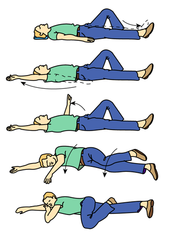
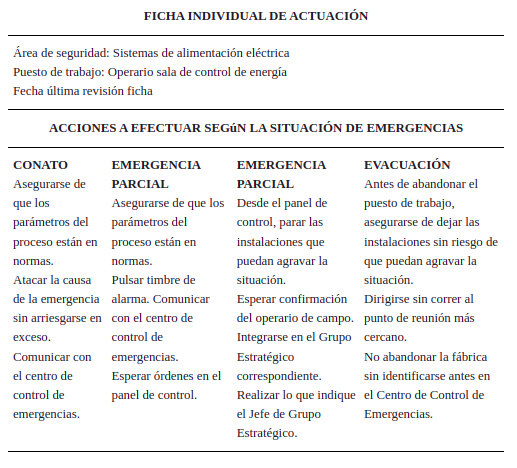
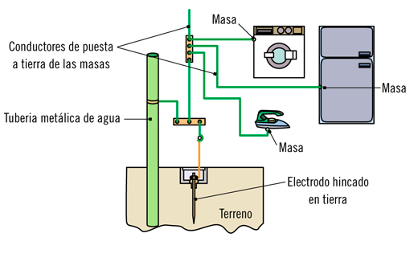
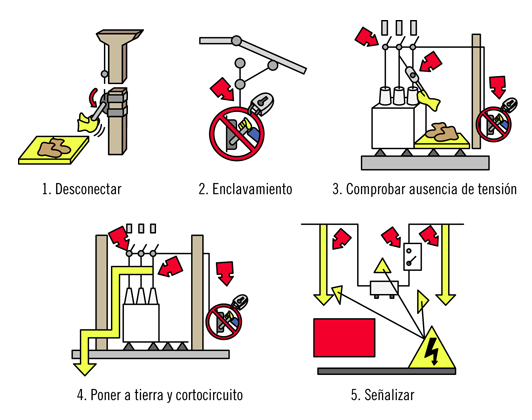

3.- Actuación en emergencias y evacuación
=========================================

Índice
------

- Tipos de accidentes.
- Evaluación primaria del accidentado.
- Primeros auxilios.
- Socorrismo.
- Situaciones de emergencia.
- Planes de emergencia y evacuación.
- Información de apoyo para la actuación de emergencias.

Tipos de accidentes
-------------------

Se enumeran a continuación los diferentes tipos de accidentes:

- Caídas al mismo nivel
- Caídas de personas a distinto nivel
- Caída de objetos por desplome o derrumbamiento
- Caída de objetos en su manipulación
- Caída de objetos desprendidos
- Pisadas sobre objetos
- Choques contra objetos inmóviles.
- Choques contra objetos móviles
- Golpes o cortes por objetos o herramientas
- Proyección de fragmentos o partículas
- Atrapamiento por o entre objetos
- Atrapamiento por vuelco de máquinas o vehículos
- Sobresfuerzos
- Exposicion a temperaturas mbientales extremas
- Contactos térmicos
- Contactos eléctricos directos
- Contctos eléctricos indirectos
- Exposición a substancias nocivas o tóxicas
- Contactos con sustancias cáusticas o corrosivas
- Exposición a radiaciones
- Explosiones
- Incendios
- Accidentes causados por seres vivos
- Atropellos o golpes con vehículos

Alguna de las causas que pueden dar lugar a estos accidentes son:

- Zonas de operación desprotegidas (por ejemplo arquetas).
- Ausencia de alarmas (por ejemplo marcha atras carretilla)
- Paro de emergencias inexistente o defectuoso
- Productos peligrosos no identificados
- Inestabilidad en el almacenaje
- Protección frente a contactos eléctricos
- Aberturas y huecos desprotegidos
- Escaleras inseguras o en mal estado
- Falta de orden y limpieza
- Iluminación oncorrecta
- Uso indebido de herramientas o útiles de trabajo
- Fatiga física
- Fatiga mental
- Falta de corrección de riesgo
- Falta de uso de los EPI o que estos sean no adecuados

Evaluación primaria del accidentado
-----------------------------------

La falta de oxígeno en el cerebro causa lesiones irreversibles en el 
mismo en muy poco tiempo. Por ello la rapidez en la actuación es vital.

Cuando se produce un accidente se debe atender en la secuencia de 
acciones que idetifican la sigla **PAS**

- **Proteger** Se debe proteger tanto al accidentado como a uno mismo.
- **Avisar** A los servicios de emergencias (112)
- **Socorrer** Ahora ya se puede actuar sobre el accidentado.

**Nota:** Es importante en caso de electrocución cortar la corriente y 
si no es posible separar al accidentado mediante el uso de un elemento 
aislado.

Una vez hemos llegado al paso de socorrer. Llevaremos  cabo una
evaluación primaria:

- Comprobar si el accidentado se encuentra consciente (hablandole, 
mediante estimulo doloroso)

- Comprobar respiración: Acercando nuestra oreja a las vías 
respiratorias, y miranco hacia el pecho, para oir las inhalaciones y 
exhalaciones y a la vez, comprobar el movimiento del pecho:

- Comprobar el pulso: Colocando indice y corazon en el cuello, al lado y
por debajo de la nuez de Adán.
  

    <figure style="display=inline-block">
      
      <figcaption>Operación fronto-mentón</figcaption>
    </figure>
  

Socorrismo
----------

Realizada la evaluación promaria del accidentado, se procederá a:

- En caso de que respire se le colocara en PLS o Posición lateral de
  seguridad.
  

    <figure style="display=inline-block">
      
      <figcaption>Posición Lateral de Seguridad</figcaption>
    </figure>
  

- En caso de que no respire, se le colocará en posición de decúbito
  supino. Estirado y mirando hacia arriba. Y se comprobará que no 
  tiene cuerpos extraños. Finalmente se realizará la maniobra 
  fronto-menton e hiperextensión del cuello (una mano empuja hacia 
  abajo y la otra estira de la nuca hacia arriba).
  

    <figure style="display=inline-block">
      
      <figcaption>Operación fronto-mentón</figcaption>
    </figure>
  

- Si la respiración no se reinicia será necesario realizar la 
  respiración artificial:
    1. Tender al accidentado boca arriba.
    2. Eliminar cuerpos extraños de la boca
    3. Maniobra de hiper-extensión del cuello.
    4. Insuflar aire por la boca del accidentado tapando la nariz, y
       comprobar que el pecho se eleva.
    5. Repetir insuflaciones durante 5s

- Finalmente si no existe pulso, deberán realizarse una RCP (reanimación
cardiopulmonar):
    1. Si tenemos un desfibrilador. Es suficiente seguir las 
       indicaciones. En caso contrario, seguiremos con los pasos 2 y 3.
    2. Colocar las manos cruzadas en el externon (entre las costillas).
    3. Realizar 30 compresiones por cada 2 ventilaciones.

Situaciones de emergencia
-------------------------

Existen varias situaciones de emergencias que deberan ser analizadas y
adoptar las medidas necesarias en evacuación de trabajadores, lucha
contra-incendios y primeros auxilios. Se designará personal encargado de
su puesta en práctica y se comprobará periodicamente su rápidez, 
eficacia y buen funcionamiento.

Existen varias situciones dependiendo de su gravedad:
- Conato de emergencia
- Emergencia parcial
- Emergencia general
- Evacuación

Las acciones a tomar son:
- Alertar ráapidamente
- Activar alarmas de evacuacion
- Intervenir para controlar la emergencia
- Apoyar a los servicios de ayuda exterior.

Es importante **centralizar el contro de emergencias en un mismo lugar**
por ejemplo, la oficina técnica, la recepción, etc.

Planes de emergencia y evacuación
---------------------------------

Un plan de emergencia establece los recursos humanos  y materiales para
combatir una emergencia. Si hay orden de evacuación se deberán seguir
estos pasos:
- Seguir instrucciones de los equipos de intervención
- Mantener la calma.
- Evacuar rápido pero sin correr
- No retroceder para recoger objetos personales
- No hacer uso de ascensores
- Cerrar puestas y ventanas que se encuentren en el camino
- Dirigirse (si existe al punto de reunión).
- Si hay humo, desplazarse agachado y con un pañuelo humedo sobre la 
  boca y naríz.
- Si se prende la ropa rodar por el suelo.
- Si se está atrapado tapar con trapos humedos las rendijas y hacer
  notar la presencia hasta ser rescatado.

Información de apoyo para la actuación de emergencias
-----------------------------------------------------

En el **Manual de emergencia** se desarrolla todo lo referente a las 
acciones a llevar a cabo en una situación de emergencia por cada
trabajador.

En la **ficha individual de actuación** se indican de manera resumida, 
las acciones a efectuar según la situaión de emergencia según el puesto
de trabajo

  

    <figure style="display=inline-block">
      
      <figcaption>Ficha individual de actuación</figcaption>
    </figure>
  

Los **carteles divulgativos** presentan de forma esquematica las 
actuaciones para cada situación de emergéncia.

4.- Prevención y seguridad en el montaje de instalaciones electrotécnicas y de telecomunicaciones
================================================================================================

Elementos de protección de las instalaciones
--------------------------------------------

Existen varios elementos de protección de las instalaciones, destacan:

### Elementos de protección contra cortocircuitos
Un cortocircuito es el paso de una corriente eléctrica por un circuito
de baja resistencia, lo que ocasiona intensidades de miles de amperios.
Los cortocircuitos pueden desembocar en incendios, fusiones de 
elementos, explosiones, etc.
Las instalaciones se protegen de los cortocircuitos mediante:

- **Fusibles:** (elementos que se funden al circular por ellos una 
intensidad más  elevada que su calibre, desconectando la instalacion una
vez fundidos).
- **Interruptores Magnetotérmicos:** Tienen una parte magnética que
actua debido a los cortocircuitos, disparando el interruptor. Este, una
vez solucionado el problema, puede ser rearmado.

### Elementos de protección contra sobrecargas
Las sobrecargas es la circulación de intensidades más elevadas por un
circuito que aquellas para las que fue diseñado. Aunque sin ser del
orden de magnitud de los cortocircuitos.
Pueden llegar a degradar los aislamientos de los elementos conductores
y provocar un incendio o un cortocircuitos.

Los elementos de protección son los mismos que en el caso anterior 
(fusibles y magnetotérmicos).

### Elementos de protección contra la electrocución:

- Separación de elementos con tensión y masas metálicas mediante el uso
de elementos aislantes
- Utilización de tensiones de seguridad (por ejemplo los 12V de la
iluminación de las piscinas
- Conexiones equipotenciales
- Puesta a tierra de las partes metálicas
  

    <figure style="display=inline-block">
      
      <figcaption>Esquema de puesta a tierra</figcaption>
    </figure>
  

- Uso de interruptores diferenciales, que al detectar una fuga (que 
podria ser a traves de una persona) desconectan la alimentación del 
circuito.

  

    <figure style="display=inline-block">
      
      <figcaption>protección por diferencial</figcaption>
    </figure>
  

### Elementos de protección contra sobretensiones
Existen dos tipos de protecciones contra sobretensiones los primeros
protegen contra los picos de tensión provocados por ejemplo por la caída
de un rayo, que suelen ser intensos, pero cortos. Los segundos 
protegen contra tensiones sinusoidales constantes pero de amplitud más 
elevada, como los provocado por la rotura del neutro del transformador.

3. Identificación de riesgos y medidas de seguridad
---------------------------------------------------

### Trabajos sin tensión. Cinco reglas de oro

Las cinco reglas de oro para trabajos sin tensión de forma segura son:
1. Abrir con corte visible todas las fuentes de tensión
2. Prevenir cualquier posible conexión, bloqueando los dispositivos
3. Verificar la ausencia de tensión
4. Puesta a tierra y en cortocircuito de las fuentes de tensión
5. Delimitar y señalizar la zona de trabajo

  

    <figure style="display=inline-block">
      
      <figcaption>5 reglas de oro</figcaption>
    </figure>
  

Una vez realizados los trabajos se restablecerá el servicio con los
siguientes pasos:

1. Retirada de las protecciones adicionales y de la señalización de la 
zona de trabajo.
2. Retirada de la puesta a tierra y el cortocircuito de las fuentes de
tensión.
3. Desbloqueo de los elementos de corte
4. Rearmado de los circuitos y reestablecimiento de la tensión.

### Trabajos en altura.
Son los realizados mediante alguno de los siguientes equipos auxiliares 
de trabajo:

- Escaleras de mano
- Andamios
- Sistema de acceso mediante cuerda
- Plataformas Elevadoras Móviles d ePersonal
- Transelevadores, con operador a bordo.

El orden de preferencia en cuanto a la elección de medios auxiliares
para trabajos en altura son:

1. El acceso directo desde el nivel inferior
2. Un elevador
3. Andamio
3. Escalera o rampa
4. Escala

No se debe utilizar una escalera metálica para trabajos eléctricos.

Se recomienda la adopción de las medidas que aparecen en la NTP-239,
entre ellas:

- Instalación de dispositivos anticaidas.
- Estabilidad de las escaleras: apoyadas sobre superficie no
resbaladiza, resistente y segura y su parte superior no se debe apoyar 
sobre superficies resbaladizas, columnas redondas o delgadas, esquinas o
puertas.
- Utilizar accesorios para sortear las dificultades antes mencionadas.

### Trabajos en zonas humedas
Debido a que el agua es buen conductor de la electricidad debe
prestarse especial cuidado en las medidas preventivas:

- Puesta a tierra de las masas metálicas
- Calzado de lata resistencia eléctrica
- Revisar que no hau acumulaciones de agua en cuadros electricos y cajas

### Trabajos en tensión
Solo deberan realizarse por personal especializado y en algunas 
ocasiones también deben ensayarse previamente. Finalmente en los casos
en los que estos trabajos se hagan en lugares remotos o mal comunicados
es necesaria la presencia de dos trabajadores.

Además (en baja tensión), utilizaremos el método de trabajo en contacto
con protección aislante, las herramientas serán aisladas eléctricamente
para potenciales de hasta 1kV. Y con los EPIs necesarios. Además se
deberá contar con formación especifica.

Si hay condensadores (al poder estos acumular energía), se procedera del
siguiente modo:

1. Desconexión mediante maniobra visible.
2. Aplicación de circuito de descarga conectado a tierra.
3. Puesta a tierra y en cortocircuito de los condensadores.

### Trabajos en lugares con riesgo de explosión
Los lugares con riesgo de explosión son aquellos en los que se pueden
llegar a generar atmósferas explosivas, como:

* Garajes y talleres de reparación
* Lavanderías y tintorerias con lavado en seco
* Zonas de tratamiento de textiles
* Industrias de procesado de madera
* Lugares con trasvases de líquidos inflamables

La principal protección para este tipo de trabajos es evitar la
aparición de atmósferas explosivas, mediante sistemas de extracción de 
aire.

Además se contará con equipos detectores de atmósferas explosivas.

Los trabajos en instalaciones eléctircas en estos lugares se harán sin 
tensión, incluso un cambio de bombilla.

Se comprobará con mayor frecuencia el buen estado de las instalaciones.

### Electricidad estática
Se produce por la acumulación de carga eléctrica, por ejemplo por 
rozamiento. Las principales medidas para evitarlo son:

* Mantener la humedad relativa del aire por encima del 50%
* Conectar a tierra partes metálicas que puedan acumular carga
* Aplicar productos antiestáticos en las superficies susceptibles
* Utilizar ionizadores de aire
* Usar suelos de materiales disipadores.

Donde se pueda acumular carga estática deberá utilizarse EPIs con 
marcado antiestático.

### Descargas eléctricas
Se seguirán estar medidas preventivas:

* Uso de herramientas y EPI con aislamiento eléctrico
* Se comprobará el buen estado de diferenciales y magnetotérmicos
* Mantenimiento de sistemas de puesta a tierra
* Uso de ropa antiestática si es necesario

### Frecuencias eléctricas
Los sistemas de corriente alterna son más peligrosos que los de 
continua, ya que el umbral de fibrilación es más elevado y a que es 
posible soltar los electrodos.

### Contactos eléctricos directos
Se deben prevenir alejando las partes activas, señalizándolas y 
utilizando EPIs adecuados.

### Contactos eléctricos indirectos
Se evitarán con las medidas siguientes:
* Puesta a tierra de los elementos metalicos de los equipos eléctricos
* Uso de interruptores diferenciales
* Uniones equipotenciales
* Uso de equipos con doble aislamiento
